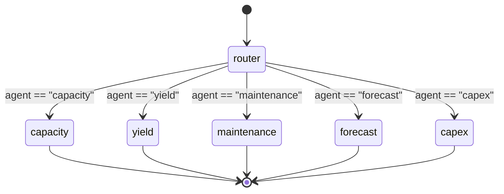
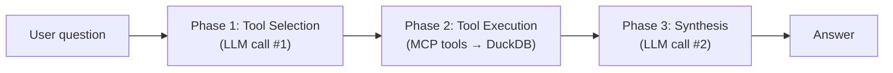

# AI Enablement — Agentic Architecture

---

## Overview

The agentic layer enables **natural-language querying** of the entire DuckDB gold layer. A user types a question; the system routes it to the correct domain agent; the agent selects and executes the appropriate MCP tools; and a local LLM synthesises a human-readable answer.

**All inference is local.** No external API calls. No data leaves the machine.

---

## Component Map

```
agentic/
├── mcp_server/
│   ├── server.py          ← stdio JSON-RPC MCP entry point
│   ├── db.py              ← shared read-only DuckDB connection
│   ├── test_server.py     ← 19-test smoke test suite
│   └── tools/
│       ├── schema_tools.py       ← list_tables, get_schema, get_table_preview, get_distinct_values
│       ├── capacity_tools.py     ← get_capacity_summary, get_bottleneck_analysis, get_demand_vs_supply, get_equipment_utilization
│       ├── yield_tools.py        ← get_yield_prediction, get_yield_drivers, get_ml_adjusted_capacity
│       ├── maintenance_tools.py  ← get_maintenance_alerts, get_failure_risk_trend
│       ├── forecast_tools.py     ← get_demand_forecast, get_forecast_accuracy
│       ├── capex_tools.py        ← get_capex_recommendation, get_capex_scenarios
│       └── query_tool.py         ← run_query (fallback, read-only SQL)
└── agents/
    ├── config.py          ← ChatOllama factory, settings.yaml reader
    ├── state.py           ← AgentState TypedDict
    ├── router.py          ← RouterNode + route_to_agent edge function
    ├── base_agent.py      ← BaseAgent: tool selection → execution → synthesis
    ├── domain_agents.py   ← 5 domain agents + AGENT_REGISTRY
    ├── orchestrator.py    ← compiled LangGraph graph + ask() + ask_stream()
    └── test_agents.py     ← 10-test end-to-end test suite
```

---

## LangGraph Architecture

### Graph Definition

```python
# orchestrator.py
builder = StateGraph(AgentState)
builder.add_node("router", router_node)
builder.add_node("capacity",    CapacityAgent().run)
builder.add_node("yield",       YieldAgent().run)
builder.add_node("maintenance", MaintenanceAgent().run)
builder.add_node("forecast",    ForecastAgent().run)
builder.add_node("capex",       CapExAgent().run)

builder.add_edge(START, "router")
builder.add_conditional_edges("router", route_to_agent, {...})
# All agents → END
graph = builder.compile()
```

### Graph Flow



### AgentState

```python
class AgentState(TypedDict):
    messages:     Annotated[list, add_messages]  # full conversation history
    agent:        str                             # set by router
    tool_results: list[dict[str, Any]]            # raw MCP tool outputs
    answer:       str                             # synthesised response
    error:        str | None                      # error if any
```

`add_messages` is a LangGraph reducer — it merges incoming message lists rather than replacing them, enabling multi-turn conversation history.

---

## Router Node

**File**: `agentic/agents/router.py`

### Responsibility

Classify the user's natural-language question into one of 5 domains and set `state["agent"]`.

### LLM Configuration

```python
ChatOllama(
    model="llama3.1:8b",
    temperature=0.0,    # deterministic — routing must be consistent
    num_predict=64,     # only needs short JSON output
    streaming=False,    # needs complete response before routing
)
```

### Prompt Strategy

Zero-shot classification. No examples — domain descriptions are sufficiently distinct:

```
You are a routing assistant for a manufacturing capacity planning system.
Classify the user's question into exactly one of these domains:

- "capacity": Questions about equipment utilisation, supply vs demand,
  bottlenecks, capacity gaps...
- "yield": Questions about manufacturing yield rates, ML-predicted yield,
  SHAP drivers...
[... 5 domains ...]

Respond with ONLY a JSON object:
{"domain": "<domain_name>", "confidence": <0.0-1.0>, "reasoning": "<one sentence>"}
```

### Failure Handling

If the LLM produces malformed JSON or an unrecognised domain, the router falls back to `"capacity"` — the most general domain with the broadest tool set. The fallback is silent (no error to user).

### Routing Test Results (10/10 correct)

| Question | Expected | Got |
|---|---|---|
| "Which sites have CRITICAL bottlenecks?" | capacity | capacity ✓ |
| "What drives yield loss for OTA tests?" | yield | yield ✓ |
| "Show HIGH maintenance risk equipment" | maintenance | maintenance ✓ |
| "Demand forecast for next 6 months" | forecast | forecast ✓ |
| "P80 CapEx recommendation for OTA testers?" | capex | capex ✓ |

---

## Base Agent

**File**: `agentic/agents/base_agent.py`

All 5 domain agents inherit from `BaseAgent`. The base class implements the three-phase execution loop:



### Phase 1: Tool Selection

The LLM is given:
- Agent name and domain description
- Available tools (name + first line of docstring)
- User question

Output: JSON array of tool calls:
```json
[
  {"tool": "get_bottleneck_analysis", "args": {"severity": "CRITICAL", "limit": 50}},
  {"tool": "get_capacity_summary",    "args": {"month_from": 202401}}
]
```

### Phase 2: Tool Execution

Each selected tool is called as a Python function — not via stdio. The MCP server functions are imported directly in `domain_agents.py`. Results are collected in `state["tool_results"]`.

### Phase 3: Synthesis

The LLM receives the user question + all tool results (truncated to first 50 rows per tool to avoid context overflow) and writes a human-readable answer.

**Synthesis prompt key instruction**: `"Write the COMPLETE answer. Do not truncate or summarise prematurely."` — added to address response truncation observed with llama3.1:8b at default `num_predict=2048`.

### Context Management

Tool results are truncated before synthesis:
```python
if len(rows) > 50:
    r = {**r, "rows": rows[:50], "note": f"Showing first 50 of {len(rows)} rows"}
```

This prevents context window overflow (llama3.1:8b has ~128K token context but Ollama's default `num_predict=4096` limits generation length).

---

## Domain Agents

**File**: `agentic/agents/domain_agents.py`

Each agent defines: `name`, `description`, `system_prompt`, `tools` dict.

### CapacityAgent

**Responsibility**: Answer questions about equipment utilisation, supply/demand balance, bottlenecks, and capacity gaps.

**Tools**: `get_capacity_summary`, `get_bottleneck_analysis`, `get_demand_vs_supply`, `get_equipment_utilization` + schema tools + `run_query`

**System prompt key knowledge**:
- Utilisation > 85% = constrained
- Gap% < −15% = CRITICAL bottleneck
- Capacity modes: NORMAL vs MAXIMUM
- Site code format: e.g. `SG01`
- Test types: OTA/TRX/PIM/PAM/FCT/ICT/BIT/ALT/UC/AT

### YieldAgent

**Responsibility**: Answer questions about ML-predicted yield, yield loss drivers (SHAP), and how yield changes affect capacity.

**Tools**: `get_yield_prediction`, `get_yield_drivers`, `get_ml_adjusted_capacity` + schema tools + `run_query`

**System prompt key knowledge**:
- Yield expressed as fraction (0–1); 0.85 = 85% first-pass yield
- Lower yield → more retests → less effective capacity
- SHAP values: positive = increases yield, negative = reduces yield
- `gold_cap_ml_adjusted` = capacity with ML yield vs static baseline

### MaintenanceAgent

**Responsibility**: Answer questions about equipment failure risk, predictive maintenance alerts, and OEE-based risk scoring.

**Tools**: `get_maintenance_alerts`, `get_failure_risk_trend` + schema tools + `run_query`

**System prompt key knowledge**:
- Failure = OEE < 0.88 within 3 months
- Risk tiers: LOW (<20%), MEDIUM (20–40%), HIGH (40–70%), CRITICAL (>70%)
- OEE range in data: 0.81–0.98

### ForecastAgent

**Responsibility**: Answer questions about 18-month demand forecasts, forecast accuracy, and NPI product ramp.

**Tools**: `get_demand_forecast`, `get_forecast_accuracy` + schema tools + `run_query`

**System prompt key knowledge**:
- Ensemble: Prophet + XGBoost + LightGBM; NPI = Croston
- Forecast months in yyyymm format (e.g. 202307)
- MAPE: <10% good, 10–20% acceptable, >20% review

### CapExAgent

**Responsibility**: Answer questions about Monte Carlo equipment recommendations and capital expenditure scenarios.

**Tools**: `get_capex_recommendation`, `get_capex_scenarios` + schema tools + `run_query`

**System prompt key knowledge**:
- 10,000 simulations per combo
- P50 = median scenario, P80 = recommended, P95 = conservative
- `delta_units_p80` = additional testers needed at P80 above current
- All 10 equipment unit costs

---

## MCP Server

**File**: `agentic/mcp_server/server.py`

### Transport Modes

The MCP server supports two usage modes:

| Mode | How | When Used |
|---|---|---|
| **Direct Python import** | Functions imported in `domain_agents.py` | LangGraph agent execution (primary) |
| **stdio JSON-RPC** | `python -m agentic.mcp_server.server` | Claude Desktop or external MCP clients |

### Protocol

The stdio mode implements [MCP Protocol 2024-11-05](https://modelcontextprotocol.io), using JSON-RPC 2.0 over stdin/stdout:

```
Client → Server: {"jsonrpc":"2.0","id":1,"method":"initialize","params":{...}}
Server → Client: {"jsonrpc":"2.0","id":1,"result":{"protocolVersion":"2024-11-05",...}}

Client → Server: {"jsonrpc":"2.0","id":2,"method":"tools/list","params":{}}
Server → Client: {"jsonrpc":"2.0","id":2,"result":{"tools":[...]}}

Client → Server: {"jsonrpc":"2.0","id":3,"method":"tools/call","params":{"name":"get_bottleneck_analysis","arguments":{"severity":"CRITICAL"}}}
Server → Client: {"jsonrpc":"2.0","id":3,"result":{"content":[{"type":"text","text":"{...}"}]}}
```

### Tool Registry

20 tools registered in `TOOL_REGISTRY` dict in `server.py`:

| Domain | Tools |
|---|---|
| Schema | `list_tables`, `get_schema`, `get_table_preview`, `get_distinct_values` |
| Capacity | `get_capacity_summary`, `get_bottleneck_analysis`, `get_demand_vs_supply`, `get_equipment_utilization` |
| Yield | `get_yield_prediction`, `get_yield_drivers`, `get_ml_adjusted_capacity` |
| Maintenance | `get_maintenance_alerts`, `get_failure_risk_trend` |
| Forecast | `get_demand_forecast`, `get_forecast_accuracy` |
| CapEx | `get_capex_recommendation`, `get_capex_scenarios` |
| Fallback | `run_query` |

### Safety

The `run_query` fallback tool enforces read-only access:

```python
_BLOCKED = ("insert", "update", "delete", "drop", "create", "alter",
            "truncate", "replace", "merge", "copy", "attach", "detach")

def _is_safe(sql: str) -> bool:
    first = sql.strip().split()[0].lower()
    return first not in _BLOCKED
```

The DuckDB connection itself is opened with `read_only=True`, providing a second layer of protection.

### Example Tool Call and Response

**Input** (from agent or external client):
```json
{
  "tool": "get_bottleneck_analysis",
  "args": {
    "severity": "CRITICAL",
    "month_from": 202401,
    "month_to": 202406,
    "limit": 10
  }
}
```

**Output**:
```json
{
  "columns": ["site_code", "test_type", "month_key", "capacity_mode",
              "bottleneck_severity", "avg_gap_pct", "min_gap_pct",
              "avg_utilization_pct", "affected_products", "affected_demand_qty",
              "total_investment_need_units", "worst_gap_qty"],
  "rows": [
    {
      "site_code": "SG01",
      "test_type": "OTA",
      "month_key": 202401,
      "capacity_mode": "NORMAL",
      "bottleneck_severity": "CRITICAL",
      "avg_gap_pct": -23.4,
      "min_gap_pct": -31.2,
      "avg_utilization_pct": 1.31,
      "affected_products": 4,
      "affected_demand_qty": 58000.0,
      "total_investment_need_units": 3,
      "worst_gap_qty": -18120.0
    }
  ],
  "row_count": 1
}
```

### Smoke Test Coverage (19/19 passing)

```
✓ list_tables: 26 rows/items
✓ get_schema
✓ get_table_preview
✓ get_distinct_values
✓ get_capacity_summary
✓ get_bottleneck_analysis
✓ get_demand_vs_supply
✓ get_equipment_utilization
✓ get_yield_prediction
✓ get_yield_drivers
✓ get_ml_adjusted_capacity
✓ get_maintenance_alerts
✓ get_failure_risk_trend
✓ get_demand_forecast
✓ get_forecast_accuracy
✓ get_capex_recommendation
✓ get_capex_scenarios
✓ run_query (SELECT)
✓ run_query (INSERT blocked)
```

---

## FastAPI Backend

**File**: `backend/main.py`
**Port**: 8000

### Endpoints

| Method | Path | Description |
|---|---|---|
| `GET` | `/` | Serves `frontend/index.html` |
| `GET` | `/api/health` | Returns status + agent list |
| `GET` | `/api/agents` | Returns agent registry with tool lists |
| `POST` | `/api/chat` | Full synchronous response (JSON) |
| `POST` | `/api/chat/stream` | SSE streaming response |

### SSE Event Types

The streaming endpoint emits newline-delimited JSON events:

```
data: {"type": "pipeline", "data": {"step": "router", "detail": "→ CAPACITY agent", "agent": "capacity"}}

data: {"type": "pipeline", "data": {"step": "tool_selection", "detail": "CAPACITY agent selected 2 tool(s)"}}

data: {"type": "pipeline", "data": {"step": "mcp_tool", "detail": "get_bottleneck_analysis → DuckDB → 47 rows", "tool": "get_bottleneck_analysis", "row_count": 47}}

data: {"type": "pipeline", "data": {"step": "synthesis", "detail": "Synthesizing answer via Ollama…"}}

data: {"type": "token", "data": "Based "}
data: {"type": "token", "data": "on "}
data: {"type": "token", "data": "the "}
...

data: {"type": "done", "data": {"agent": "capacity", "tools_called": ["get_bottleneck_analysis"], "tool_count": 1}}
```

The frontend renders pipeline steps as a live trace in the left panel while tokens stream word-by-word into the chat message.

---

## Data Explorer Backend

**File**: `backend/explorer/main.py`
**Port**: 8001

### Endpoints

| Method | Path | Description |
|---|---|---|
| `GET` | `/explorer/` | Serves explorer frontend |
| `GET` | `/explorer/api/sources` | All data sources + tables grouped by layer |
| `GET` | `/explorer/api/schema/{source}/{table}` | Column names + types + row count |
| `GET` | `/explorer/api/data/{source}/{table}` | Paginated rows with filter + sort |
| `GET` | `/explorer/api/distinct/{source}/{table}/{col}` | Distinct values for a column |
| `POST` | `/explorer/api/query/{source}` | Execute a custom SELECT |

### Source Discovery

On startup, the explorer auto-discovers all `.db` files in `data/` (SQLite raw sources) and the DuckDB analytics database. Sources are registered in `SOURCES` dict and served at `/explorer/api/sources`.

### Layer Classification

DuckDB table names are classified by prefix:

```python
def _table_layer(table_name: str) -> str:
    if table_name.startswith("brnz_"):              return "bronze"
    if table_name.startswith("slvr_"):              return "silver"
    if table_name.startswith(("gold_", "srv_vw_")): return "gold"
    return "raw"
```
