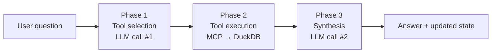

# Domain Agents

> **Files**: `agentic/agents/config.py`, `state.py`, `router.py`, `base_agent.py`, `domain_agents.py`, `orchestrator.py`
> **Test**: `uv run python agentic/agents/test_agents.py` → 10/10 passing

---

## How is the LLM configured?

`config.py` reads `config/settings.yaml` and returns `ChatOllama` instances:

| Function | Model | `temperature` | `num_predict` | `streaming` |
|---|---|---|---|---|
| `get_router_llm()` | `router_model` | 0.0 (deterministic) | 64 (short JSON only) | False |
| `get_llm()` | `default_model` | 0.1 | 4096 | Configurable |

**Why `num_predict=4096` for agents?** Default Ollama cap is 2048 tokens. Complex capacity answers with multiple sites/products were being truncated mid-sentence. 4096 resolves this.

**Settings.yaml agentic section:**
```yaml
agentic:
  llm_provider:     ollama
  ollama_base_url:  http://localhost:11434
  default_model:    llama3.1:8b
  router_model:     llama3.1:8b
  temperature:      0.1
  max_tokens:       4096
  streaming:        true
```

---

## What is `AgentState`?

The shared data structure passed between every LangGraph node:

```python
class AgentState(TypedDict):
    messages:     Annotated[list, add_messages]  # full conversation history
    agent:        str                             # set by RouterNode
    tool_results: list[dict[str, Any]]            # raw MCP tool outputs
    answer:       str                             # synthesised LLM response
    error:        str | None                      # error string if any step fails
```

`add_messages` is a LangGraph **reducer** — appends incoming messages rather than replacing the list, enabling multi-turn history across nodes.

---

## Router Node (`router.py`)

### What does it do?

Reads the latest `HumanMessage` from `state["messages"]`, sends it to the LLM with a classification prompt, and sets `state["agent"]` to one of 5 domain names.

### Prompt strategy

Zero-shot — no few-shot examples. Domain descriptions are distinct enough:

```
Classify into exactly one of:
"capacity"    — utilisation, bottlenecks, supply/demand gaps
"yield"       — yield rates, SHAP drivers, ML-adjusted capacity
"maintenance" — failure risk, OEE alerts, predictive maintenance
"forecast"    — demand forecast, MAPE, NPI ramp
"capex"       — Monte Carlo equipment recommendations, P80 CapEx
Respond ONLY: {"domain": "...", "confidence": 0.0-1.0, "reasoning": "..."}
```

### Failure handling

| Failure mode | Behaviour |
|---|---|
| Malformed JSON | Regex extracts `{...}` block; if none found → fallback |
| Unrecognised domain | Silently falls back to `"capacity"` |
| LLM timeout/error | `except Exception` → fallback to `"capacity"` |

### `route_to_agent(state)` — conditional edge function

```python
def route_to_agent(state: AgentState) -> str:
    return state.get("agent", "capacity")
```

LangGraph uses this return value to select which node to visit next.

### Routing accuracy (test results)

| Question | Expected | Result |
|---|---|---|
| "Which sites have CRITICAL bottlenecks?" | capacity | ✓ |
| "What drives yield loss for OTA tests?" | yield | ✓ |
| "Show HIGH maintenance risk equipment" | maintenance | ✓ |
| "Demand forecast for next 6 months" | forecast | ✓ |
| "P80 CapEx for OTA testers?" | capex | ✓ |

---

## Base Agent (`base_agent.py`)

All 5 agents inherit `run()` from `BaseAgent`. The three-phase loop:



### Phase 1 — Tool selection prompt

```
You are a {name} analyst.
{system_prompt}

Available tools:
- tool_name: first line of docstring
...

User question: {question}

Respond ONLY with a JSON array:
[{"tool": "...", "args": {key: value, ...}}, ...]
```

LLM output is cleaned of markdown fences, then `re.search(r'\[.*?\]', text, re.DOTALL)` extracts the array. Empty array `[]` = no tool needed.

### Phase 2 — Tool execution

Tools are called as **direct Python callables**:
```python
result = self.tools[tool_name](**args)
results.append({"tool": tool_name, "result": result})
```

No stdio round-trip — functions imported from `agentic/mcp_server/tools/` directly.

### Phase 3 — Synthesis prompt

```
You are a {name} analyst.
{system_prompt}

User asked: {question}

Tool results:
{json.dumps(truncated_results)}

Write the COMPLETE answer. Do not truncate or summarise prematurely.
Use specific numbers. Highlight problems first. Use bullet points for lists.
```

**Context management**: rows truncated to first 50 per tool before synthesis to prevent context overflow:
```python
if len(rows) > 50:
    r["rows"] = rows[:50]
    r["note"] = f"Showing first 50 of {len(rows)} rows"
```

---

## The 5 Domain Agents (`domain_agents.py`)

### CapacityAgent

| Property | Value |
|---|---|
| `name` | `"capacity"` |
| **Handles** | Utilisation, bottlenecks, supply/demand, equipment gaps |
| **Domain tools** | `get_capacity_summary`, `get_bottleneck_analysis`, `get_demand_vs_supply`, `get_equipment_utilization` |
| **Shared tools** | All 4 schema tools + `run_query` |
| **Key prompt knowledge** | utilisation > 85% = constrained; gap% < −15% = CRITICAL; modes: NORMAL vs MAXIMUM |

---

### YieldAgent

| Property | Value |
|---|---|
| `name` | `"yield"` |
| **Handles** | ML yield predictions, SHAP drivers, ML-adjusted capacity |
| **Domain tools** | `get_yield_prediction`, `get_yield_drivers`, `get_ml_adjusted_capacity` |
| **Key prompt knowledge** | Yield as fraction 0–1; lower yield → more retests → less supply; positive SHAP = increases yield |

---

### MaintenanceAgent

| Property | Value |
|---|---|
| `name` | `"maintenance"` |
| **Handles** | Failure risk scores, HIGH/CRITICAL alerts, OEE trends |
| **Domain tools** | `get_maintenance_alerts`, `get_failure_risk_trend` |
| **Key prompt knowledge** | Failure = OEE < 0.88 within 3 months; risk tiers: LOW/MEDIUM/HIGH/CRITICAL |

---

### ForecastAgent

| Property | Value |
|---|---|
| `name` | `"forecast"` |
| **Handles** | 18-month demand forecasts, accuracy metrics, NPI ramp |
| **Domain tools** | `get_demand_forecast`, `get_forecast_accuracy` |
| **Key prompt knowledge** | Ensemble = Prophet+XGB+LGB; NPI = Croston; months in yyyymm; MAPE < 10% = good |

---

### CapExAgent

| Property | Value |
|---|---|
| `name` | `"capex"` |
| **Handles** | Monte Carlo equipment recommendations, investment scenarios |
| **Domain tools** | `get_capex_recommendation`, `get_capex_scenarios` |
| **Key prompt knowledge** | P80 = recommended; `delta_units_p80` = additional units needed; all 10 equipment costs |

---

### `AGENT_REGISTRY`

```python
AGENT_REGISTRY: dict[str, BaseAgent] = {
    "capacity":    CapacityAgent(),
    "yield":       YieldAgent(),
    "maintenance": MaintenanceAgent(),
    "forecast":    ForecastAgent(),
    "capex":       CapExAgent(),
}
```

Used by both `orchestrator.py` (node registration) and `backend/main.py` (agent listing endpoint).

---

## Orchestrator (`orchestrator.py`)

### Graph compilation

```python
builder = StateGraph(AgentState)
builder.add_node("router", router_node)
for name, agent in AGENT_REGISTRY.items():
    builder.add_node(name, agent.run)

builder.add_edge(START, "router")
builder.add_conditional_edges("router", route_to_agent,
                              {name: name for name in AGENT_REGISTRY})
for name in AGENT_REGISTRY:
    builder.add_edge(name, END)

graph = builder.compile()
```

### `ask(question)` — synchronous helper

```python
result = graph.invoke({
    "messages": [HumanMessage(content=question)],
    "agent": "", "tool_results": [], "answer": "", "error": None
})
# returns: {answer, agent, tool_results, error}
```

### `ask_stream(question)` — streaming helper

Uses `graph.stream(..., stream_mode="updates")` — yields `{node_name: state_delta}` dicts as each node completes. The FastAPI backend consumes this to emit SSE events.

---

## End-to-end test results (10/10)

| Test | Type | Result |
|---|---|---|
| 5 routing tests | Router classification | ✓ All correct |
| Capacity agent full query | Tools called: 2, ~73s | ✓ |
| Yield agent full query | Tools called: 2, ~46s | ✓ |
| Maintenance agent full query | Tools called: 1, ~57s | ✓ |
| Forecast agent full query | Tools called: 2, ~45s | ✓ |
| CapEx agent full query | Tools called: 1, ~39s | ✓ |

Wall times reflect 2 LLM calls per agent on llama3.1:8b via local Ollama.
