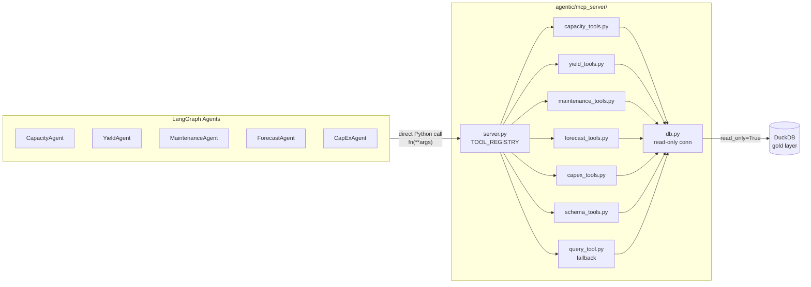

# MCP Server

> **Entry point**: `agentic/mcp_server/server.py`
> **Tools**: 20 registered tools across 6 domains
> **Transport**: stdio JSON-RPC 2.0 (MCP Protocol 2024-11-05)
> **Smoke test**: `uv run python agentic/mcp_server/test_server.py` → 19/19 passing

---

## What is the MCP server's role?

> *"A structured, read-only data API layer between agents and DuckDB."*

Without MCP, each agent would need to write raw SQL. With MCP:
- Tools encapsulate query logic behind typed function signatures
- Agents only decide *which tool* and *what parameters* — never write SQL
- Read-only DuckDB connection enforced at the connection layer, not just by convention
- Same tools usable by Claude Desktop via stdio transport

---

## Architecture



---

## Two transport modes — what's the difference?

| Mode | How tools are called | When used |
|---|---|---|
| **Direct Python import** | `fn(**args)` inside `domain_agents.py` | LangGraph agents (primary) |
| **stdio JSON-RPC** | `python -m agentic.mcp_server.server` | Claude Desktop / external clients |

The same tool functions serve both modes — `server.py` is just a protocol wrapper around `TOOL_REGISTRY`.

---

## stdio protocol flow

```
Client → {"jsonrpc":"2.0","id":1,"method":"initialize","params":{}}
Server → {"jsonrpc":"2.0","id":1,"result":{"protocolVersion":"2024-11-05",...}}

Client → {"jsonrpc":"2.0","id":2,"method":"tools/list"}
Server → {"jsonrpc":"2.0","id":2,"result":{"tools":[{name, description, inputSchema}, ...]}}

Client → {"jsonrpc":"2.0","id":3,"method":"tools/call",
          "params":{"name":"get_bottleneck_analysis","arguments":{"severity":"CRITICAL"}}}
Server → {"jsonrpc":"2.0","id":3,"result":{"content":[{"type":"text","text":"{...}"}]}}
```

`notifications/initialized` receives no response — it is a one-way notification.

---

## `db.py` — shared connection

**Why a separate module?** Every tool file imports `from agentic.mcp_server.db import query`. Centralising the connection ensures:
- `read_only=True` enforced once, not per-tool
- Path resolution (`parents[2]` from `db.py` → project root) in one place
- `query()` returns `list[dict]` — consistent return type across all tools

```python
PROJECT_ROOT = Path(__file__).resolve().parents[2]
DB_PATH      = PROJECT_ROOT / "data" / "capacity_planning_twin.duckdb"

def get_conn():
    return duckdb.connect(str(DB_PATH), read_only=True)

def query(sql, params=None) -> list[dict]:
    conn = get_conn()
    rel  = conn.execute(sql, params or [])
    cols = [d[0] for d in rel.description]
    return [dict(zip(cols, row)) for row in rel.fetchall()]
```

---

## Full Tool Registry

### Schema Tools (`schema_tools.py`)

Available to all agents via `_SCHEMA_TOOLS` dict in `domain_agents.py`.

| Tool | Key args | Returns |
|---|---|---|
| `list_tables` | — | `{tables: [...], views: [...], total: N}` |
| `get_schema` | `table_name` | `{columns: [{name, type}], column_count, row_count}` |
| `get_table_preview` | `table_name`, `limit=5` | First N rows as `{columns, rows}` |
| `get_distinct_values` | `table_name`, `column_name`, `limit=50` | `{values: [...], count}` |

---

### Capacity Tools (`capacity_tools.py`)

Source tables: `gold_cap_normal`, `gold_bottleneck`, `gold_dmnd_vs_cap`, `srv_vw_equipment_utilization`

| Tool | Key args | Key columns returned |
|---|---|---|
| `get_capacity_summary` | `site_code`, `month_from`, `month_to`, `limit=100` | `site_code`, `test_type`, `month_key`, `capacity_mode`, `total_supply`, `total_demand`, `avg_utilization_pct`, `avg_gap_pct`, `total_investment_need_units` |
| `get_bottleneck_analysis` | `site_code`, `severity`, `month_from`, `month_to`, `limit=100` | `bottleneck_severity`, `avg_gap_pct`, `min_gap_pct`, `affected_products`, `total_investment_need_units` |
| `get_demand_vs_supply` | `product_number`, `site_code`, `month_from`, `month_to`, `limit=200` | `demand_qty`, `capacity_qty`, `gap_qty`, `gap_pct`, `utilization_pct`, `bottleneck_severity` |
| `get_equipment_utilization` | `site_code`, `test_type`, `limit=100` | `avg_utilization_pct`, `max_utilization_pct`, `total_demand_qty`, `total_investment_need` |

**`severity` valid values**: `CRITICAL`, `HIGH`, `MEDIUM`, `LOW`, `BALANCED`, `EXCESS`

---

### Yield Tools (`yield_tools.py`)

Source tables: `gold_yield_predictions`, `gold_yield_shap`, `gold_cap_ml_adjusted`

| Tool | Key args | Key columns returned |
|---|---|---|
| `get_yield_prediction` | `site_code`, `test_type`, `product_number`, `month_from`, `month_to`, `limit=200` | `actual_yield`, `predicted_yield`, `error_percentage_points` |
| `get_yield_drivers` | `site_code`, `test_type`, `top_n=10` | `feature`, `mean_abs_shap`, `mean_shap_value`, `n_predictions` |
| `get_ml_adjusted_capacity` | `site_code`, `test_type`, `month_from`, `month_to`, `limit=200` | `baseline_yield`, `ml_predicted_yield`, `supply_ml`, `capacity_gap_pct_ml` |

**`get_yield_drivers` join logic**: `gold_yield_shap.row_idx` aligns with `rowid` of `gold_yield_predictions`. Filtered predictions are joined to SHAP values, then aggregated by feature.

---

### Maintenance Tools (`maintenance_tools.py`)

Source tables: `gold_maintenance_alerts`, `gold_maintenance_risk`

| Tool | Key args | Key columns returned |
|---|---|---|
| `get_maintenance_alerts` | `site_code`, `test_type`, `risk_tier`, `month_from`, `month_to`, `limit=200` | `risk_tier`, `failure_probability`, `avg_oee`, `alert_generated_at` |
| `get_failure_risk_trend` | `site_code`, `test_type`, `month_from`, `month_to`, `limit=200` | `failure_probability`, `risk_tier`, `avg_oee`, `actual_failure_occurred` |

**`risk_tier` valid values**: `HIGH`, `CRITICAL` (alerts table only stores these two)

---

### Forecast Tools (`forecast_tools.py`)

Source tables: `gold_demand_forecast`, `gold_forecast_accuracy_ml`

| Tool | Key args | Key columns returned |
|---|---|---|
| `get_demand_forecast` | `product_number`, `site_code`, `month_from`, `month_to`, `forecast_method`, `limit=200` | `forecast_month_key`, `forecast_horizon_months`, `demand_forecast`, `forecast_method` |
| `get_forecast_accuracy` | `product_number`, `site_code`, `limit=100` | `mape_pct`, `smape_pct`, `rmse`, `mae` + `summary` dict |

`get_forecast_accuracy` appends a `summary` key to its return dict: `{median_mape_pct, mean_mape_pct, total_series}`.

---

### CapEx Tools (`capex_tools.py`)

Source tables: `gold_capex_mc_summary`, `gold_capex_mc_scenarios`

| Tool | Key args | Key columns returned |
|---|---|---|
| `get_capex_recommendation` | `site_code`, `test_type`, `limit=100` | `eq_needed_p50/p80/p95`, `delta_units_p80`, `capex_usd_p80`, `equipment_unit_cost_usd` |
| `get_capex_scenarios` | `site_code`, `test_type`, `limit=200` | `scenario`, `equipment_qty`, `probability_sufficient`, `capex_usd` |

`get_capex_recommendation` also returns `total_capex_p80_usd` as a top-level key in the result dict (sum across all returned rows).

---

### Fallback Tool (`query_tool.py`)

| Tool | Args | Behaviour |
|---|---|---|
| `run_query` | `sql: str`, `limit=500` | Executes any SELECT; auto-appends `LIMIT` if absent; blocks mutating statements |

**Safety guard**:
```python
_BLOCKED = ("insert","update","delete","drop","create","alter",
            "truncate","replace","merge","copy","attach","detach")

def _is_safe(sql):
    return sql.strip().split()[0].lower() not in _BLOCKED
```

Two-layer safety: SQL guard (keyword check) + `read_only=True` DuckDB connection.

---

## Standard tool response shape

All tools return the same dict structure:

```json
{
  "columns":   ["col1", "col2", ...],
  "rows":      [{...}, {...}, ...],
  "row_count": N
}
```

On error:
```json
{ "error": "error message string" }
```

Agents check for the `"error"` key before using results.

---

## Example: full tool call and response

**Input** (from agent or Claude Desktop):
```json
{
  "name": "get_bottleneck_analysis",
  "arguments": { "severity": "CRITICAL", "month_from": 202401, "limit": 3 }
}
```

**Output**:
```json
{
  "columns": ["site_code","test_type","month_key","capacity_mode",
              "bottleneck_severity","avg_gap_pct","min_gap_pct",
              "avg_utilization_pct","affected_products",
              "affected_demand_qty","total_investment_need_units","worst_gap_qty"],
  "rows": [
    { "site_code": "SG01", "test_type": "OTA", "month_key": 202401,
      "capacity_mode": "NORMAL", "bottleneck_severity": "CRITICAL",
      "avg_gap_pct": -23.4, "min_gap_pct": -31.2,
      "avg_utilization_pct": 1.31, "affected_products": 4,
      "affected_demand_qty": 58000.0, "total_investment_need_units": 3,
      "worst_gap_qty": -18120.0 }
  ],
  "row_count": 1
}
```

---

## Smoke test results (19/19 passing)

```
✓ list_tables              ✓ get_capacity_summary       ✓ get_yield_prediction
✓ get_schema               ✓ get_bottleneck_analysis    ✓ get_yield_drivers
✓ get_table_preview        ✓ get_demand_vs_supply       ✓ get_ml_adjusted_capacity
✓ get_distinct_values      ✓ get_equipment_utilization  ✓ get_maintenance_alerts
✓ get_demand_forecast      ✓ get_failure_risk_trend     ✓ get_capex_recommendation
✓ get_forecast_accuracy    ✓ get_capex_scenarios
✓ run_query (SELECT)       ✓ run_query (INSERT blocked)
```

Run with: `uv run python agentic/mcp_server/test_server.py`
