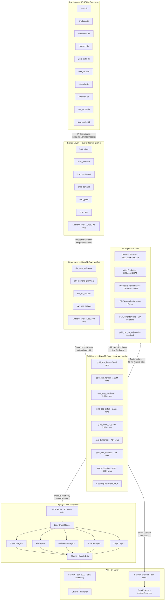
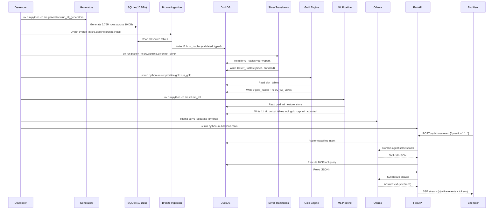
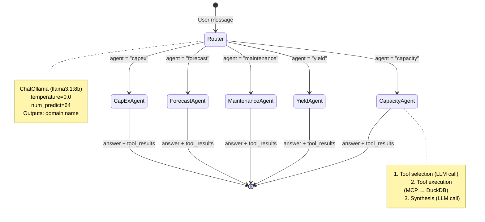
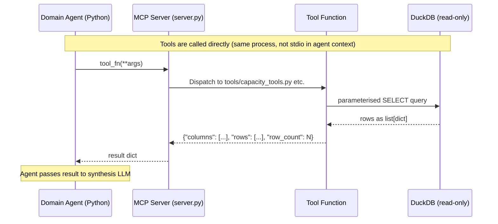
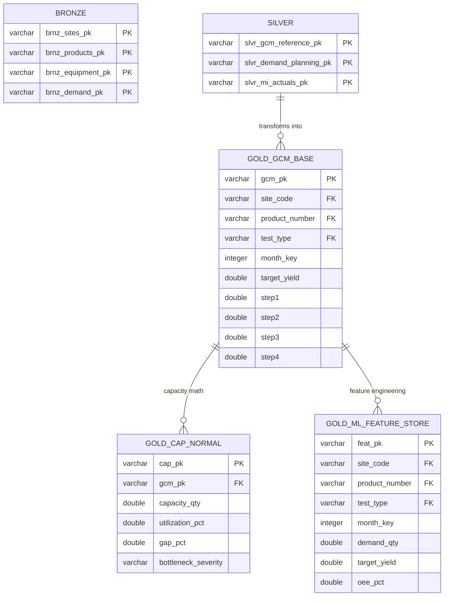

# System Architecture

---

## End-to-End Architecture

---

## Execution Flow

---

## Data Flow Diagram

```mermaid
flowchart LR
    subgraph SOURCES["Source Systems (Synthetic)"]
        direction TB
        S1[Sites & Suppliers]
        S2[Products & Families]
        S3[Equipment Specs]
        S4[Demand Plans]
        S5[Yield Records]
        S6[OEE Records]
        S7[Calendar]
        S8[GCM Config]
    end

    subgraph PIPELINE["Data Pipeline"]
        direction TB
        B["Bronze\nSchema validation\nType casting\nNull checks\nDedup"]
        SL["Silver\nJoins & enrichment\nMonth/year features\nLag features\nNPI flags\nYield forward-fill"]
        G["Gold\n5-step capacity math\nBottleneck classification\nOEE metrics\nML feature store\nServing views"]
    end

    subgraph MLPIPE["ML Pipeline"]
        direction TB
        M1["Demand Forecast\nProphet+XGB+LGB ensemble\nCroston for NPI"]
        M2["Yield Prediction\nXGBoost + SHAP\n→ capacity feedback"]
        M3["Predictive Maintenance\nXGBoost + SMOTE"]
        M4["OEE Anomaly\nIsolation Forest"]
        M5["CapEx Monte Carlo\n10K simulations\nP50/P80/P95"]
    end

    subgraph SERVING["Serving Layer"]
        direction TB
        A["MCP Server\n20 tools\nRead-only DuckDB"]
        AG["5 Domain Agents\nLangGraph\nllama3.1:8b"]
        API2["FastAPI\nSSE streaming"]
    end

    SOURCES --> PIPELINE
    PIPELINE --> MLPIPE
    MLPIPE -.->|yield feedback| PIPELINE
    PIPELINE --> SERVING
    MLPIPE --> SERVING
```

---

## LangGraph Agent Graph

---

## MCP Communication Flow

> **Note**: The MCP server implements the JSON-RPC 2.0 stdio protocol for Claude Desktop compatibility, but within the LangGraph agentic system, tool functions are called directly as Python callables — the stdio transport is used only when connecting via external MCP clients (e.g. Claude Desktop).

---

## Database Architecture

All data lives in **one DuckDB file**: `data/capacity_planning_twin.duckdb`, schema `main`.

---

## Layer Prefix Convention

| Prefix | Layer | Example |
|---|---|---|
| `brnz_` | Bronze | `brnz_sites`, `brnz_products` |
| `slvr_` | Silver | `slvr_gcm_reference`, `slvr_demand_planning` |
| `gold_` | Gold (tables) | `gold_gcm_base`, `gold_bottleneck` |
| `srv_vw_` | Gold (serving views) | `srv_vw_capacity_summary`, `srv_vw_bottleneck_heatmap` |
