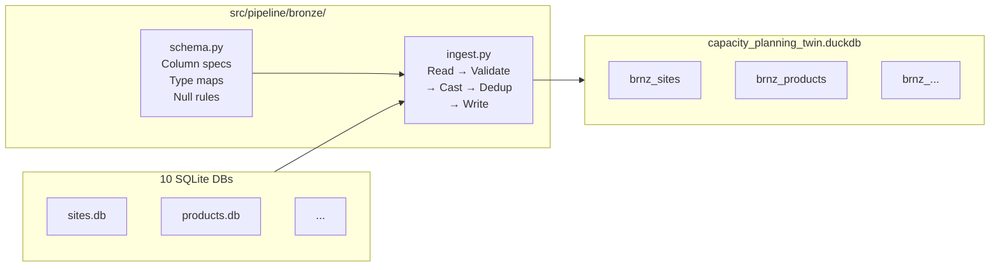

# Bronze Layer

> **Entry point**: `uv run python -m src.pipeline.bronze.ingest`
> **Files**: `src/pipeline/bronze/schema.py`, `src/pipeline/bronze/ingest.py`
> **Output**: 12 `brnz_` tables in `data/capacity_planning_twin.duckdb`, 2,751,592 rows, 0 invalid rows.

---

## Purpose

Bronze is the first processed layer. It performs no business logic — its only job is to take raw SQLite data and make it **trustworthy**: correctly typed, validated, deduplicated, and written to DuckDB in a consistent schema. Every downstream layer depends on Bronze being clean.

---

## Ingestion Flow

### Steps per table

1. **Read** — connect to the source SQLite file, read the full table into a pandas DataFrame
2. **Validate schema** — check that all expected columns are present; raise if any are missing
3. **Cast types** — convert each column to its canonical DuckDB type (VARCHAR, DOUBLE, BIGINT, BOOLEAN)
4. **Null check** — assert non-null constraints on primary key and critical columns; log any violations
5. **Dedup** — drop exact duplicate rows based on the primary key column(s)
6. **Write** — drop-and-recreate the `brnz_` table in DuckDB using `CREATE TABLE AS SELECT`

---

## Schema Definitions (`schema.py`)

`schema.py` defines a `BRONZE_SCHEMAS` dict mapping each table name to:
- Expected column names and canonical types
- Non-null constraints
- Primary key column(s)

This acts as a lightweight contract between generators and the pipeline. If a generator changes a column name, Bronze fails fast with a clear error rather than silently propagating bad data downstream.

---

## Bronze Tables Reference

### `brnz_sites`
Source: `sites.db · sites`

| Column | Type | Nullable |
|---|---|---|
| `site_code` | VARCHAR | NOT NULL (PK) |
| `site_name` | VARCHAR | NOT NULL |
| `factory_code` | VARCHAR | NOT NULL |
| `supplier_id` | VARCHAR | NOT NULL |
| `country` | VARCHAR | NOT NULL |
| `region` | VARCHAR | NOT NULL |
| `timezone` | VARCHAR | — |
| `is_active` | BIGINT | NOT NULL |

---

### `brnz_suppliers`
Source: `suppliers.db · suppliers`

| Column | Type | Nullable |
|---|---|---|
| `supplier_id` | VARCHAR | NOT NULL (PK) |
| `supplier_name` | VARCHAR | NOT NULL |
| `supplier_type` | VARCHAR | — |
| `hq_country` | VARCHAR | — |
| `tier` | BIGINT | — |

---

### `brnz_products`
Source: `products.db · products`

| Column | Type | Nullable |
|---|---|---|
| `product_number` | VARCHAR | NOT NULL (PK) |
| `product_description` | VARCHAR | — |
| `platform` | VARCHAR | NOT NULL |
| `product_family` | VARCHAR | NOT NULL |
| `product_status` | VARCHAR | NOT NULL |
| `product_type` | VARCHAR | — |
| `is_parent` | BIGINT | NOT NULL |
| `has_children` | BIGINT | NOT NULL |

---

### `brnz_product_hierarchy`
Source: `products.db · product_hierarchy`

| Column | Type | Nullable |
|---|---|---|
| `parent_product_number` | VARCHAR | NOT NULL |
| `child_product_number` | VARCHAR | NOT NULL |
| `child_quantity` | DOUBLE | NOT NULL |

**Composite PK**: `(parent_product_number, child_product_number)`

---

### `brnz_test_types`
Source: `test_types.db · test_types`

| Column | Type | Nullable |
|---|---|---|
| `test_type` | VARCHAR | NOT NULL (PK) |
| `test_category_id` | VARCHAR | NOT NULL |
| `test_category_name` | VARCHAR | NOT NULL |
| `typical_test_time_sec` | DOUBLE | — |
| `equipment_cost_usd` | DOUBLE | — |
| `requires_rf_chamber` | BIGINT | — |

---

### `brnz_equipment`
Source: `equipment.db · equipment`

| Column | Type | Nullable |
|---|---|---|
| `equipment_id` | VARCHAR | NOT NULL (PK) |
| `equipment_type` | VARCHAR | NOT NULL |
| `test_type` | VARCHAR | NOT NULL |
| `handling_time_sec` | DOUBLE | NOT NULL |
| `qualification_time_sec` | DOUBLE | — |
| `cycle_time_sec` | DOUBLE | — |
| `unit_cost_usd` | DOUBLE | — |
| `useful_life_years` | BIGINT | — |

---

### `brnz_site_equipment_mapping`
Source: `equipment.db · site_equipment_mapping`

| Column | Type | Nullable |
|---|---|---|
| `site_code` | VARCHAR | NOT NULL |
| `equipment_id` | VARCHAR | NOT NULL |
| `equip_qty_available` | BIGINT | NOT NULL |

**Composite PK**: `(site_code, equipment_id)`

---

### `brnz_calendar`
Source: `calendar.db · calendar`

| Column | Type | Nullable |
|---|---|---|
| `month_key` | BIGINT | NOT NULL (PK) |
| `year` | BIGINT | NOT NULL |
| `month_of_year` | BIGINT | NOT NULL |
| `quarter` | BIGINT | NOT NULL |
| `working_days_normal` | BIGINT | NOT NULL |
| `working_days_max` | BIGINT | NOT NULL |
| `shifts_per_day_normal` | BIGINT | NOT NULL |
| `shifts_per_day_max` | BIGINT | NOT NULL |
| `hours_per_shift_normal` | DOUBLE | NOT NULL |
| `hours_per_shift_max` | DOUBLE | NOT NULL |
| `is_quarter_end` | BIGINT | NOT NULL |

---

### `brnz_gcm_config`
Source: `gcm_config.db · gcm_config`

| Column | Type | Nullable |
|---|---|---|
| `gcm_config_id` | VARCHAR | NOT NULL (PK) |
| `site_code` | VARCHAR | NOT NULL |
| `product_number` | VARCHAR | NOT NULL |
| `test_type` | VARCHAR | NOT NULL |
| `snapshot_id` | VARCHAR | NOT NULL |
| `target_test_time_sec` | DOUBLE | NOT NULL |
| `target_yield` | DOUBLE | NOT NULL |
| `utilization_rate` | DOUBLE | NOT NULL |
| `allowance_pct` | DOUBLE | NOT NULL |
| `productivity_pct` | DOUBLE | NOT NULL |
| `retest_type` | VARCHAR | NOT NULL |
| `yield_retest_1` | DOUBLE | — |
| `yield_retest_2_plus` | DOUBLE | — |
| `retest_quote` | DOUBLE | — |

---

### `brnz_demand`
Source: `demand.db · demand`

| Column | Type | Nullable |
|---|---|---|
| `demand_id` | VARCHAR | NOT NULL (PK) |
| `product_number` | VARCHAR | NOT NULL |
| `site_code` | VARCHAR | NOT NULL |
| `snapshot_id` | VARCHAR | NOT NULL |
| `month_key` | BIGINT | NOT NULL |
| `demand_qty` | DOUBLE | NOT NULL |
| `is_actual` | BIGINT | NOT NULL |
| `data_type` | VARCHAR | NOT NULL |

---

### `brnz_yield`
Source: `yield_data.db · yield_data`

| Column | Type | Nullable |
|---|---|---|
| `yield_id` | VARCHAR | NOT NULL (PK) |
| `product_number` | VARCHAR | NOT NULL |
| `test_type` | VARCHAR | NOT NULL |
| `site_code` | VARCHAR | NOT NULL |
| `month_key` | BIGINT | NOT NULL |
| `actual_yield` | DOUBLE | NOT NULL |
| `yield_forward_filled` | BIGINT | NOT NULL |

---

### `brnz_oee`
Source: `oee_data.db · oee_data`

| Column | Type | Nullable |
|---|---|---|
| `oee_id` | VARCHAR | NOT NULL (PK) |
| `site_code` | VARCHAR | NOT NULL |
| `test_type` | VARCHAR | NOT NULL |
| `month_key` | BIGINT | NOT NULL |
| `availability_pct` | DOUBLE | NOT NULL |
| `performance_pct` | DOUBLE | NOT NULL |
| `quality_pct` | DOUBLE | NOT NULL |
| `oee_pct` | DOUBLE | NOT NULL |
| `actual_throughput` | DOUBLE | — |
| `avg_downtime_hr` | DOUBLE | — |

---

## Validation Results

| Check | Result |
|---|---|
| Schema validation (all 12 tables) | ✅ 0 failures |
| Null constraint violations | ✅ 0 violations |
| Duplicate rows removed | ✅ 0 duplicates found |
| Total rows ingested | 2,751,592 |
| Wall time | ~30 seconds |

---

## Key Design Decisions

**Drop-and-recreate, not upsert**: Since all data is synthetic and regenerated from scratch, the simplest and most reliable pattern is to drop the Bronze table and recreate it on every run. This avoids incremental merge complexity with no tradeoff for this use case.

**No business logic**: Bronze adds zero derived columns. The only transformations are type casts (e.g. SQLite's untyped integers → DuckDB BIGINT). All enrichment and computation happens in Silver and Gold.

**Loguru for logging**: Every table ingestion logs row count, validation results, and wall time. The log file rotates at 10MB and is retained for 30 days.
