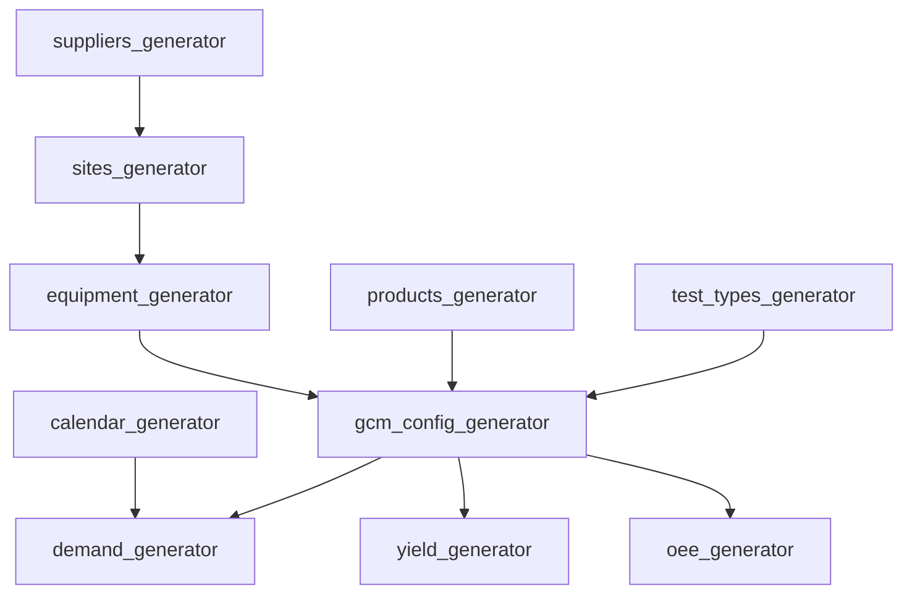

# Synthetic Data Generation

> All generators live in `src/generators/`. Each writes to its own SQLite database in `data/`. Run all at once with `uv run python -m src.generators.run_all_generators`.

---

## Why Synthetic Data?

This project models a proprietary manufacturing environment. Synthetic data allows full control over data characteristics — NPI product ramps, yield degradation curves, equipment over-provisioning ratios — without any confidentiality constraints. Every parameter is tuned to produce realistic distributions that exercise the capacity math edge cases.

---

## Generation Order and Dependencies

Generators must run in dependency order. `run_all_generators.py` enforces this sequence:

---

## Generator 1 — `sites_generator.py` → `data/sites.db`

**Table**: `sites`

Generates 22 manufacturing sites across 6 suppliers and 18 countries.

| Column | Type | Description |
|---|---|---|
| `site_code` | TEXT PK | Unique site identifier (e.g. `SG01`, `DE03`) |
| `site_name` | TEXT | Full site name |
| `factory_code` | TEXT | Factory grouping code |
| `supplier_id` | TEXT FK | Links to `suppliers.supplier_id` |
| `country` | TEXT | ISO country name |
| `region` | TEXT | APAC / EMEA / AMER |
| `timezone` | TEXT | IANA timezone string |
| `is_active` | INTEGER | 1 = active |

**Logic**: Site codes are constructed as `{COUNTRY_CODE}{NN}`. Each supplier is assigned 3–5 sites. APAC has the highest concentration (10 sites), followed by EMEA (8) and AMER (4).

---

## Generator 2 — `suppliers_generator.py` → `data/suppliers.db`

**Table**: `suppliers`

Generates the 6 supplier entities that operate the 22 sites.

| Column | Type | Description |
|---|---|---|
| `supplier_id` | TEXT PK | Supplier identifier |
| `supplier_name` | TEXT | e.g. Ericsson, Jabil, Flex, Infineon, Sanmina, Luxshare |
| `supplier_type` | TEXT | EMS / IDM / ODM |
| `hq_country` | TEXT | Headquarters country |
| `tier` | INTEGER | 1 = primary, 2 = secondary |

---

## Generator 3 — `products_generator.py` → `data/products.db`

**Tables**: `products`, `product_hierarchy`

Generates 35 products across 5 platforms and 17 product families, plus parent-child hierarchy relationships.

### `products` table

| Column | Type | Description |
|---|---|---|
| `product_number` | TEXT PK | e.g. `PRD-001` |
| `product_description` | TEXT | Human-readable name |
| `platform` | TEXT | One of 5 platform codes |
| `product_family` | TEXT | One of 17 family codes |
| `product_status` | TEXT | `ACTIVE`, `NPI`, or `EOL` |
| `product_type` | TEXT | Hardware category |
| `is_parent` | INTEGER | 1 if this product has children |
| `has_children` | INTEGER | 1 if child records exist |

### `product_hierarchy` table

| Column | Type | Description |
|---|---|---|
| `parent_product_number` | TEXT FK | Parent product |
| `child_product_number` | TEXT FK | Child component |
| `child_quantity` | REAL | Units of child per parent unit |

**Critical logic**: Child demand is always `parent_demand_qty × child_quantity`. There is no ratio split — if a parent needs 1,000 units and `child_quantity = 2`, the child needs exactly 2,000 units.

**NPI products**: 5–7 products are designated NPI. They receive:
- Only 2–3 qualified test sites (vs 5–10 for mature products)
- Demand ramp starting at ~20% of steady-state, reaching 100% over 12 months
- Yield starting 12 percentage points below the product's steady-state target

---

## Generator 4 — `equipment_generator.py` → `data/equipment.db`

**Tables**: `equipment`, `site_equipment_mapping`

### `equipment` table

| Column | Type | Description |
|---|---|---|
| `equipment_id` | TEXT PK | e.g. `EQ-OTA-001` |
| `equipment_type` | TEXT | Tester model name |
| `test_type` | TEXT FK | Which test type this equipment runs |
| `handling_time_sec` | REAL | Seconds to load/unload one DUT |
| `qualification_time_sec` | REAL | Time for equipment qualification |
| `cycle_time_sec` | REAL | Total cycle time (handling + test) |
| `unit_cost_usd` | REAL | Purchase cost in USD |
| `useful_life_years` | INTEGER | Expected equipment lifespan |

### `site_equipment_mapping` table

| Column | Type | Description |
|---|---|---|
| `site_code` | TEXT FK | Manufacturing site |
| `equipment_id` | TEXT FK | Equipment type |
| `equip_qty_available` | INTEGER | Number of testers of this type at this site |

**Over-provisioning logic**: Equipment quantities are set to produce the observed EXCESS-heavy distribution (82% EXCESS). Most sites have 10–30% more testers than needed at normal demand. A subset of site × test_type combinations are intentionally under-provisioned to produce the 13% CRITICAL distribution.

---

## Generator 5 — `test_types_generator.py` → `data/test_types.db`

**Table**: `test_types`

| Column | Type | Description |
|---|---|---|
| `test_type` | TEXT PK | OTA / TRX / PIM / PAM / FCT / ICT / BIT / ALT / UC / AT |
| `test_category_id` | TEXT | RF / Functional / Reliability / Acceptance |
| `test_category_name` | TEXT | Human-readable category |
| `typical_test_time_sec` | REAL | Reference test time |
| `equipment_cost_usd` | REAL | Reference unit cost |
| `requires_rf_chamber` | INTEGER | 1 for RF test types |

---

## Generator 6 — `calendar_generator.py` → `data/calendar.db`

**Table**: `calendar`

Generates one row per month from January 2023 through December 2027.

| Column | Type | Description |
|---|---|---|
| `month_key` | INTEGER PK | yyyymm format (e.g. 202301) |
| `year` | INTEGER | Calendar year |
| `month_of_year` | INTEGER | 1–12 |
| `quarter` | INTEGER | 1–4 |
| `working_days_normal` | INTEGER | Standard working days (typically 22) |
| `working_days_max` | INTEGER | Extended working days (23–25) |
| `shifts_per_day_normal` | INTEGER | Standard shifts (typically 3) |
| `shifts_per_day_max` | INTEGER | Maximum shifts (typically 4) |
| `hours_per_shift_normal` | REAL | Standard shift hours (8.0) |
| `hours_per_shift_max` | REAL | Extended shift hours (10.0) |
| `is_quarter_end` | INTEGER | 1 if month = 3, 6, 9, 12 |

---

## Generator 7 — `gcm_config_generator.py` → `data/gcm_config.db`

**Table**: `gcm_config`

The Global Capacity Model configuration table. One row per site × product × test_type × snapshot combination. This is the most critical generator — it defines all parameters used by the 5-step capacity math engine.

| Column | Type | Description |
|---|---|---|
| `gcm_config_id` | TEXT PK | Composite key |
| `site_code` | TEXT FK | Manufacturing site |
| `product_number` | TEXT FK | Product |
| `test_type` | TEXT FK | Test type |
| `snapshot_id` | TEXT | Planning snapshot identifier |
| `target_test_time_sec` | REAL | Test time used in Step 1 |
| `target_yield` | REAL | First-pass yield target (0–1) |
| `utilization_rate` | REAL | Tester utilisation rate (0–1) |
| `allowance_pct` | REAL | Allowance fraction for Step 3 |
| `productivity_pct` | REAL | Productivity fraction for Step 3 |
| `retest_type` | TEXT | `TYPE1` or `TYPE2` |
| `yield_retest_1` | REAL | First-pass yield (Type 2 only) |
| `yield_retest_2_plus` | REAL | Second-attempt yield (Type 2 only) |
| `retest_quote` | REAL | Retest fraction quote (Type 2 only) |

**Two snapshots**: Each site × product × test_type combination appears twice — once for `snap-2023-01-planning-cycle` (using 2023 baseline parameters) and once for `snap-2024-01-planning-cycle` (incorporating 2023 actuals and revised forecasts).

**OtherImpediments = 0**: By design, all impediments are captured within `allowance_pct` and `productivity_pct`. No separate impediment factor is applied anywhere in the math.

---

## Generator 8 — `demand_generator.py` → `data/demand.db`

**Table**: `demand`

Monthly demand per product × site × snapshot. Covers January 2023 through December 2027.

| Column | Type | Description |
|---|---|---|
| `demand_id` | TEXT PK | Composite key |
| `product_number` | TEXT FK | Product |
| `site_code` | TEXT FK | Manufacturing site |
| `snapshot_id` | TEXT | Planning snapshot |
| `month_key` | INTEGER | yyyymm |
| `demand_qty` | REAL | Units demanded (parent level) |
| `is_actual` | INTEGER | 1 = historical actual, 0 = forecast |
| `data_type` | TEXT | `ACTUAL` or `FORECAST` |

**Actuals range**: Jan 2023 – Jun 2026 (`is_actual = 1`)
**Forecast range**: Jul 2026 – Dec 2027 (`is_actual = 0`)

**Demand pattern logic**:
- Mature products: seasonal curve with Q4 peaks, moderate year-over-year growth
- NPI products: ramp from ~20% to 100% of steady-state over 12 months
- Snapshot differences: the 2024 snapshot revises the 2023 forecasts upward or downward based on synthetic actuals, simulating real planning cycle behaviour

---

## Generator 9 — `yield_generator.py` → `data/yield_data.db`

**Table**: `yield_data`

Monthly first-pass yield per product × test_type × site.

| Column | Type | Description |
|---|---|---|
| `yield_id` | TEXT PK | Composite key |
| `product_number` | TEXT FK | Product |
| `test_type` | TEXT FK | Test type |
| `site_code` | TEXT FK | Site |
| `month_key` | INTEGER | yyyymm |
| `actual_yield` | REAL | Measured first-pass yield (0–1) |
| `yield_forward_filled` | INTEGER | 1 if value was carried forward from prior month |

**Generation logic**:
- Base yield set per product × test_type (range: 0.72–0.97)
- NPI products start 12pp below base, ramping to base over 12 months
- Monthly variation: ±2pp Gaussian noise around base
- Missing months: yield is forward-filled in the Silver layer (not here)
- RF test types (OTA, TRX, PIM, PAM) have systematically lower yields than functional types

---

## Generator 10 — `oee_generator.py` → `data/oee_data.db`

**Table**: `oee_data`

Monthly OEE per site × test_type, decomposed into three components.

| Column | Type | Description |
|---|---|---|
| `oee_id` | TEXT PK | Composite key |
| `site_code` | TEXT FK | Site |
| `test_type` | TEXT FK | Test type |
| `month_key` | INTEGER | yyyymm |
| `availability_pct` | REAL | Actual uptime / planned uptime (0–1) |
| `performance_pct` | REAL | Actual rate / target rate (0–1) |
| `quality_pct` | REAL | Good units / total units (0–1) |
| `oee_pct` | REAL | availability × performance × quality |
| `actual_throughput` | REAL | DUTs processed |
| `avg_downtime_hr` | REAL | Average monthly downtime hours |

**Generation logic**:
- All three components sampled from Beta distributions fitted to realistic ranges
- Composite OEE = product of three components
- Resulting OEE range: **0.8077–0.9767** (mean 0.913)
- This narrow, high range reflects well-maintained semiconductor test equipment
- No OEE values fall below 0.80, which informs the 0.88 failure threshold used in predictive maintenance
