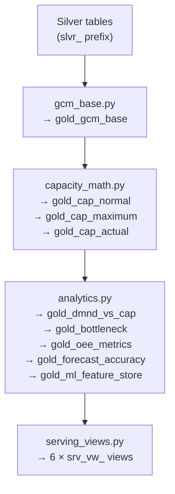

# Gold Layer

> **Entry point**: `uv run python -m src.pipeline.gold.run_gold`
> **Files**: `src/pipeline/gold/run_gold.py`, `gcm_base.py`, `capacity_math.py`, `analytics.py`, `serving_views.py`, `utils.py`
> **Output**: 9 `gold_` tables + 6 `srv_vw_` views. See [Capacity Planning Fundamentals](../technical-reference/capacity-planning.md) for all formulas.

---

## Execution Order

Gold modules must run in strict dependency order. `run_gold.py` enforces this:



---

## Module 1: `gcm_base.py` → `gold_gcm_base`

**Purpose**: Build the master GCM base table — one row per site × product × test_type × month × snapshot — with all raw parameters plus Steps 1–4 of the capacity math pre-computed.

**Source**: `slvr_gcm_reference` joined with `slvr_demand_planning`

### Pre-computed capacity steps

Steps 1–4 are computed here and stored as columns, so downstream modules can reference them without recalculating.

**Step 1** (Type 1 retest):
```sql
step1 = (handling_time_sec + target_test_time_sec)
        * (1 + (1 - target_yield) * 2.0 * 0.75)
```

**Step 1** (Type 2 retest):
```sql
retest_times = (1 - yield_retest_1 + yield_retest_2_plus) / yield_retest_2_plus
step1 = (handling_time_sec + target_test_time_sec)
        * (1 + (1 - target_yield) * retest_times * retest_quote)
```

**Step 2**:
```sql
step2 = step1 / utilization_rate
```

**Step 3** (adjusted — authoritative formula):
```sql
step3_normal = (hours_per_shift_normal * 3600
               * (1 - allowance_pct)
               * productivity_pct) / step2
```

**Step 4**:
```sql
step4_normal = working_days_normal * shifts_per_day_normal
```

### `gold_gcm_base` key columns

| Column | Description |
|---|---|
| `gcm_pk` | Composite primary key |
| `site_code`, `factory_code` | Site identifiers |
| `month_key` | yyyymm integer |
| `snapshot_id` | Planning snapshot |
| `product_number`, `product_family`, `platform` | Product hierarchy |
| `test_type`, `test_category_id` | Test classification |
| `equipment_id`, `equipment_type` | Equipment identifiers |
| `equip_qty_available` | Number of testers |
| `handling_time_sec`, `target_test_time_sec` | Raw time parameters |
| `target_yield`, `yield_forward_filled` | Yield with fill flag |
| `utilization_rate`, `allowance_pct`, `productivity_pct` | Operational parameters |
| `retest_type`, `retest_times`, `test_x_parameter` | Retest model params |
| `working_days_normal/max`, `shifts_per_day_normal/max`, `hours_per_shift_normal/max` | Shift structure |
| `effective_demand_qty`, `parent_demand_qty` | Demand (post-hierarchy) |
| `step1_avg_test_time` | Step 1 result |
| `step2_total_avg_test_time` | Step 2 result |
| `step3_productivity_raw`, `step3_productivity_adjusted` | Step 3 (both formulas) |
| `step4_monthly_shifts` | Step 4 result |
| `gcm_mi_join_key` | Key for joining with MI actuals |

**Row count**: 766,319

---

## Module 2: `capacity_math.py` → `gold_cap_normal`, `gold_cap_maximum`, `gold_cap_actual`

**Purpose**: Execute Step 5 for all three capacity modes and classify bottleneck severity.

### Step 5 computation

```sql
-- Supply
capacity_qty = equip_qty_available * step3 * step4

-- Need
step5_need = effective_demand_qty / (step3 * step4)
need_ceiling = CEIL(step5_need)

-- Gap
gap_qty = capacity_qty - effective_demand_qty
gap_pct = (capacity_qty - effective_demand_qty) / effective_demand_qty * 100

-- Utilisation
utilization_pct = effective_demand_qty / capacity_qty
```

### Bottleneck severity classification

```sql
bottleneck_severity = CASE
    WHEN gap_pct < -15  THEN 'CRITICAL'
    WHEN gap_pct < -8   THEN 'HIGH'
    WHEN gap_pct < -3   THEN 'MEDIUM'
    WHEN gap_pct < 0    THEN 'LOW'
    WHEN gap_pct <= 5   THEN 'BALANCED'
    ELSE                     'EXCESS'
END
```

### Additional derived columns

| Column | Formula |
|---|---|
| `supply_headroom_qty` | `capacity_qty - effective_demand_qty` |
| `supply_per_equip_unit` | `step3 * step4` |
| `investment_need_units` | `CEIL(step5_need) - equip_qty_available` (clamped to 0 minimum) |
| `excess_capacity_units` | `equip_qty_available - CEIL(step5_need)` (clamped to 0 minimum) |
| `is_bottleneck` | `gap_pct < 0` |
| `is_excess` | `gap_pct > 5` |

### Three capacity modes

| Table | Shift params used | Purpose |
|---|---|---|
| `gold_cap_normal` | `*_normal` columns | Baseline planning |
| `gold_cap_maximum` | `*_max` columns | Surge capacity ceiling |
| `gold_cap_actual` | Calendar actuals per month | Historical performance |

**Row counts**: `gold_cap_normal` = 1,532,638 · `gold_cap_maximum` = 1,532,638 · `gold_cap_actual` = 6,164,634

---

## Module 3: `analytics.py`

Produces five analytical tables from the capacity tables.

### `gold_dmnd_vs_cap` (3,851,794 rows)

Joins demand with both normal and maximum capacity per product × site × test_type × month. This is the primary table for demand vs supply analysis.

Key columns added vs `gold_cap_normal`:
- `supply_maximum` — capacity under maximum shifts
- `flexibility_pct` — `(supply_max - supply_normal) / supply_normal * 100`

---

### `gold_bottleneck` (73,164 rows)

Aggregated bottleneck view. One row per site × test_type × month × snapshot × capacity_mode.

This aggregates across products — a single bottleneck row represents the combined demand of all products tested on a given test type at a given site.

| Column | Aggregation |
|---|---|
| `worst_gap_qty` | MIN(gap_qty) across products |
| `avg_gap_pct` | AVG(gap_pct) across products |
| `min_gap_pct` | MIN(gap_pct) across products |
| `avg_utilization_pct` | AVG(utilization_pct) across products |
| `affected_products` | COUNT(DISTINCT product_number) |
| `affected_demand_qty` | SUM(effective_demand_qty) |
| `total_investment_need_units` | SUM(investment_need_units) |
| `bottleneck_severity` | Based on avg_gap_pct |

---

### `gold_oee_metrics` (7,602 rows)

Aggregated OEE per site × test_type × month from `slvr_oee_actuals`.

| Column | Description |
|---|---|
| `availability_pct` | Average availability across equipment |
| `performance_pct` | Average performance |
| `quality_pct` | Average quality |
| `oee_pct` | `availability * performance * quality` |
| `actual_throughput` | Total DUTs processed |
| `total_passed` | Total DUTs that passed |
| `total_produced` | Total DUTs attempted |
| `avg_downtime_hr` | Average monthly downtime |

---

### `gold_forecast_accuracy` (12,697 rows)

Compares the two planning snapshots to measure forecast accuracy.

For each product × site × month that appears in both `snap-2023-01-planning-cycle` and `snap-2024-01-planning-cycle`:

```sql
forecast_error = demand_2024_snapshot - demand_2023_snapshot
mape = ABS(forecast_error) / demand_2023_snapshot * 100
bias = AVG(forecast_error)   -- positive = over-forecast, negative = under-forecast
```

---

### `gold_ml_feature_store` (383,128 rows)

The single input source for all 5 ML models. Joins GCM base, demand planning, and MI actuals into one wide feature table. See [ML Overview](../ml/ml-overview.md) for the full column reference.

---

## Module 4: `serving_views.py` → 6 `srv_vw_` Views

Views are created as DuckDB `CREATE OR REPLACE VIEW` statements. They add no new data — they reshape existing gold tables for specific query patterns.

| View | Source tables | Purpose |
|---|---|---|
| `srv_vw_capacity_summary` | `gold_cap_normal`, `gold_bottleneck` | Cross-site capacity overview: avg utilisation, bottleneck counts, gap distribution |
| `srv_vw_bottleneck_heatmap` | `gold_bottleneck` | Site × test_type pivot for heatmap visualisation: severity counts per cell |
| `srv_vw_equipment_utilization` | `gold_cap_normal`, `brnz_site_equipment_mapping` | Per-equipment utilisation: avg, max, min capacity across months |
| `srv_vw_oee_trend` | `gold_oee_metrics` | OEE trend per site × test_type: monthly time series ready for charting |
| `srv_vw_forecast_accuracy` | `gold_forecast_accuracy` | MAPE and bias summary by product, site, and test type |
| `srv_vw_mi_actuals_summary` | `slvr_mi_actuals` | Manufacturing intelligence summary: yield + OEE by site and period |

---

## Gold Layer Verified Row Counts

| Table | Verified Count |
|---|---|
| `gold_gcm_base` | 766,319 |
| `gold_cap_normal` | 1,532,638 |
| `gold_cap_maximum` | 1,532,638 |
| `gold_cap_actual` | 6,164,634 |
| `gold_dmnd_vs_cap` | 3,851,794 |
| `gold_bottleneck` | 73,164 |
| `gold_oee_metrics` | 7,602 |
| `gold_forecast_accuracy` | 12,697 |
| `gold_ml_feature_store` | 383,128 |

All counts verified to 4 decimal places against manual SQL spot-checks.
