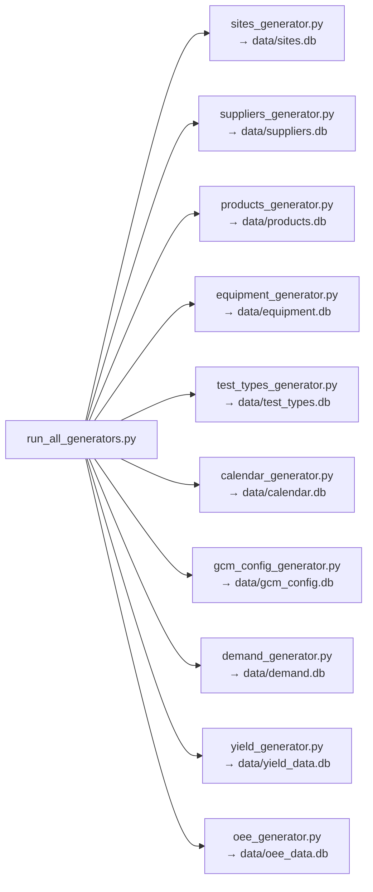
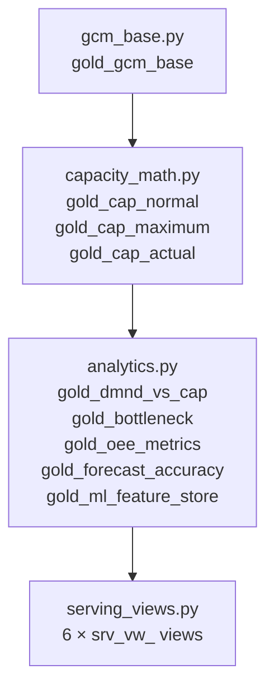

# Data Engineering — Pipeline Overview

---

## Medallion Architecture

This project implements the **medallion (lakehouse) architecture** — a layered data design pattern where data quality and refinement increase with each layer:

```
Raw (SQLite) → Bronze (DuckDB) → Silver (DuckDB) → Gold (DuckDB)
  Source of     Validated,        Joined,            Business-ready
  truth         typed, deduped    enriched, features  capacity math
```

All three processed layers (Bronze, Silver, Gold) live in **one DuckDB file** (`data/capacity_planning_twin.duckdb`) under the `main` schema, distinguished by table name prefixes.

---

## Layer Summary

| Layer | Tables | Rows | Technology | Primary Transform |
|---|---|---|---|---|
| Raw | 10 SQLite DBs | 2,751,592 | SQLite | Generation only |
| Bronze | 12 (`brnz_`) | 2,751,592 | DuckDB | Schema validation, type casting, null checks, dedup |
| Silver | 13 (`slvr_`) | 3,119,383 | PySpark → DuckDB | Joins, enrichment, lag features, forward-fill, NPI flags |
| Gold | 9 tables + 6 views | 14M+ | DuckDB SQL | Capacity math, bottleneck classification, OEE aggregation, serving views |

---

## Raw Layer — Synthetic Data Generation

### Generator Architecture

Ten independent generator modules in `src/generators/`, each writing to its own SQLite database in `data/`.



### Data Scope

| Dimension | Value |
|---|---|
| Sites | 22 (6 suppliers, 18 countries) |
| Products | 35 (5 platforms, 17 families) |
| Test Types | 10 (OTA, TRX, PIM, PAM, FCT, ICT, BIT, ALT, UC, AT) |
| Time Range | Jan 2023 – Dec 2027 (actuals: Jan 2023 – Jun 2026; forecast: Jul 2026 – Dec 2027) |
| Snapshots | 2 (`snap-2023-01-planning-cycle`, `snap-2024-01-planning-cycle`) |
| NPI Products | ~5–7 products with 2–3 qualified sites, 12-month demand ramp, yield 12% lower |

### Key Generation Logic

**Product hierarchy**: Products have parent-child relationships. Child demand is computed as `parent_demand × child_quantity` (no ratio split). This means if a parent product has demand of 1,000 units and a child component has `child_quantity = 2`, the child's demand is 2,000 units.

**Yield generation**: Base yields are set per product × test_type. NPI products start 12% lower and ramp up over 12 months. Yield is forward-filled when missing (carried from the last known value).

**Demand generation**: Two planning snapshots simulate how demand estimates evolve between planning cycles. The Jan 2024 snapshot incorporates actuals from 2023 and revised forecasts.

**Equipment logic**: Each site × test_type combination has a specific number of testers (`equip_qty_available`). Equipment quantities are set to model intentional over-provisioning at most sites (explaining the 82% EXCESS distribution in bottleneck analysis).

**OEE generation**: OEE values are generated per site × test_type × month, decomposed into Availability × Performance × Quality. The synthetic range is 0.8077–0.9767 (mean 0.913), reflecting well-maintained equipment.

**Design decision**: `OtherImpediments = 0` throughout — the capacity model assumes all impediments are captured through allowance and productivity factors.

---

## Bronze Layer

**Entry point**: `uv run python -m src.pipeline.bronze.ingest`
**Files**: `src/pipeline/bronze/schema.py`, `src/pipeline/bronze/ingest.py`

### What Bronze Does

1. Reads each SQLite source table
2. Applies schema validation (correct column names, types, non-null constraints)
3. Casts to canonical DuckDB types (VARCHAR, DOUBLE, BIGINT, BOOLEAN)
4. Checks for and removes duplicates
5. Writes to `brnz_` prefixed tables in DuckDB

### Bronze Tables

| Bronze Table | Source DB | Purpose |
|---|---|---|
| `brnz_sites` | sites.db | Site master with supplier, country, region |
| `brnz_products` | products.db | Product master with platform, family, status |
| `brnz_equipment` | equipment.db | Equipment specs per test type |
| `brnz_demand` | demand.db | Monthly demand per product × site × snapshot |
| `brnz_yield` | yield_data.db | Monthly yield per product × test type × site |
| `brnz_oee` | oee_data.db | Monthly OEE per site × test type |
| `brnz_test_types` | test_types.db | Test type reference data |
| `brnz_calendar` | calendar.db | Working days per month |
| `brnz_suppliers` | suppliers.db | Supplier master |
| `brnz_gcm_config` | gcm_config.db | GCM operational parameters (handling time, test time, shifts, etc.) |
| `brnz_product_hierarchy` | products.db | Parent-child product relationships |
| `brnz_site_equipment_mapping` | equipment.db | Which equipment exists at which site |

**Validation result**: 0 invalid rows across all 12 tables.

---

## Silver Layer

**Entry point**: `uv run python -m src.pipeline.silver.run_silver`
**Files**: `src/pipeline/silver/run_silver.py`, `transforms_reference.py`, `transforms_planning.py`, `transforms_mi.py`, `utils.py`

### What Silver Does

Silver transforms raw Bronze tables into analytical-ready datasets through:

1. **Joining** product, site, equipment, and demand tables into unified views
2. **Enriching** with calendar features (month_of_year, quarter, year, is_quarter_end)
3. **Computing lag features** (demand_lag_1, demand_lag_3, demand_lag_6, demand_lag_12)
4. **Rolling statistics** (demand_roll_avg_3, demand_roll_avg_6, demand_roll_std_3)
5. **Yield forward-fill**: When yield data is missing for a month, the last known yield is carried forward
6. **NPI flagging**: Products with fewer than 12 months of demand history or fewer than 3 qualified sites are flagged as NPI
7. **Child demand calculation**: `effective_demand_qty = parent_demand_qty × child_quantity`

### Silver Transform Modules

| Module | Tables Written | Description |
|---|---|---|
| `transforms_reference.py` | `slvr_gcm_reference` + 4 others | Joins GCM config with product/equipment master data |
| `transforms_planning.py` | `slvr_demand_planning` + 4 others | Joins demand with site/product, computes hierarchy demand, adds lag features |
| `transforms_mi.py` | `slvr_mi_actuals` + 3 others | Manufacturing intelligence: OEE, yield actuals, feature engineering |

### PySpark Usage

Silver uses PySpark in **local mode** (`SparkSession.builder.master("local[*]")`). All Silver tables are read from DuckDB via JDBC, transformed in Spark, then written back to DuckDB.

**Common error**: Spark `stack()` function requires all stacked columns to have the same type. All month columns must be cast to `double` before calling `stack()`. This is handled in `utils.py`.

Wall time: ~135 seconds on a standard development machine.

---

## Gold Layer

**Entry point**: `uv run python -m src.pipeline.gold.run_gold`
**Files**: `src/pipeline/gold/run_gold.py`, `gcm_base.py`, `capacity_math.py`, `analytics.py`, `serving_views.py`, `utils.py`

### What Gold Does

The Gold layer implements the **5-step capacity math engine** and produces all business-facing metrics. See [Capacity Planning Fundamentals](../technical-reference/capacity-planning.md) for the complete formula derivation.

### Gold Tables

| Table | Rows | Description |
|---|---|---|
| `gold_gcm_base` | 766,319 | Master GCM table: one row per product × site × test_type × month × snapshot. Contains all raw parameters and Steps 1–4. |
| `gold_cap_normal` | 1,532,638 | Normal-mode capacity: Steps 1–5 computed with normal shift parameters. Includes bottleneck severity. |
| `gold_cap_maximum` | 1,532,638 | Maximum-mode capacity: Steps 1–5 computed with extended shifts. |
| `gold_cap_actual` | 6,164,634 | Actual capacity: computed against recorded actuals (not just planning snapshots). |
| `gold_dmnd_vs_cap` | 3,851,794 | Demand vs supply comparison: joins demand with both normal and maximum capacity. |
| `gold_bottleneck` | 73,164 | Aggregated bottleneck view: one row per site × test_type × month × snapshot. Worst-case gap, severity, affected products. |
| `gold_oee_metrics` | 7,602 | OEE metrics per site × test_type × month: availability, performance, quality, composite OEE. |
| `gold_forecast_accuracy` | 12,697 | Forecast accuracy metrics from the planning snapshot comparison: MAPE, bias, absolute error. |
| `gold_ml_feature_store` | 383,128 | ML feature store: one row per site × product × test_type × month. Contains all features needed by all 5 ML models. |

### Serving Views (srv_vw_)

| View | Purpose |
|---|---|
| `srv_vw_capacity_summary` | Cross-site capacity summary: avg utilisation, gap distribution, bottleneck count |
| `srv_vw_bottleneck_heatmap` | Site × test_type heatmap data: severity counts by combination |
| `srv_vw_equipment_utilization` | Equipment utilisation per tester at each site |
| `srv_vw_oee_trend` | OEE trend per site × test_type over time |
| `srv_vw_forecast_accuracy` | Forecast accuracy by product and site |
| `srv_vw_mi_actuals_summary` | Manufacturing intelligence actuals summary |

### Gold Layer Execution Order



Each step depends on the previous — `run_gold.py` executes them in order.
