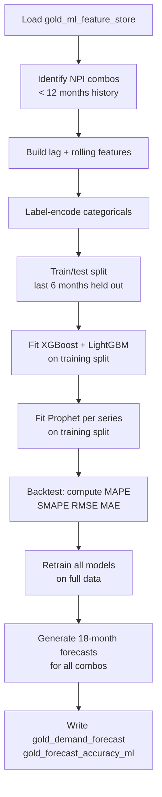

# Demand Forecasting

> **File**: `src/ml/models/demand_forecast.py`
> **Output tables**: `gold_demand_forecast` (5,688 rows), `gold_forecast_accuracy_ml` (316 rows)
> **Run time**: ~4 min (Prophet dominates; fits one model per series)

---

## What problem does this solve?

> *"How many units will each product × site combination need tested over the next 18 months?"*

Static demand plans go stale between planning cycles. This model produces a rolling 18-month probabilistic forecast that downstream CapEx and capacity models consume.

---

## Why an ensemble of three models?

No single model dominates across all series types:

| Model | Strength | Weakness |
|---|---|---|
| Prophet | Trend breaks, yearly seasonality | Can't use cross-series features |
| XGBoost | Lag features, cross-product signals | No native seasonality modelling |
| LightGBM | Fast, handles lag features well | Same weakness as XGBoost |

Combining all three with fixed weights smooths out individual weaknesses.

$$\hat{y} = 0.35 \cdot \hat{y}_{Prophet} + 0.35 \cdot \hat{y}_{XGB} + 0.30 \cdot \hat{y}_{LGB}$$

---

## Why Croston's method for NPI products?

NPI demand is **intermittent** in early months — sporadic, non-zero, irregular. Standard models assume a continuous signal. Croston separates two questions:

- *How much demand when it occurs?* → exponential smoothing on non-zero values $\hat{a}$
- *How often does it occur?* → exponential smoothing on inter-arrival intervals $\hat{q}$

$$\hat{y}_{Croston} = \frac{\hat{a}}{\hat{q}}, \quad \alpha = 0.1$$

**Trigger**: product × site has < 12 months of non-zero demand history.

---

## What features does the tree ensemble use?

| Feature group | Columns |
|---|---|
| Time index | `month_ordinal`, `month_of_year`, `year`, `quarter` |
| Demand lags | `demand_lag_1`, `_lag_2`, `_lag_3`, `_lag_6`, `_lag_12` |
| Rolling demand | `demand_roll3_mean`, `_roll6_mean`, `_roll12_mean`, `_roll3_std` |
| Yield lags | `avg_yield_lag1`, `avg_yield_lag3` |
| OEE lags | `avg_oee_lag1`, `avg_oee_lag3` |
| Encoded categoricals | `site_id`, `product_id`, `platform_id`, `family_id`, `test_type_id` |

**Categorical encoding**: label-encoded to int8 codes before training. Codes are **not** carried into `recalculate_capacity_with_ml_yield()` — the original string values from `fs` (pre-encoding) are used there to avoid type mismatch on DuckDB joins.

---

## Training process — step by step



---

## How are future feature rows constructed for tree models?

Prophet generates future dates natively. XGBoost/LightGBM cannot — they need a feature row per future month. The implementation duplicates the last known row of each series, then overwrites time-index columns:

```python
future_rows["month"]         = future_month_keys   # list of yyyymm ints
future_rows["month_ordinal"] = [year*12 + month for ...]
future_rows["month_of_year"] = [mk % 100 for mk in future_month_keys]
# lag features remain as last-known values (best available proxy)
```

This is a simplification — lag features don't update recursively into the future. For an 18-month horizon this is acceptable; for longer horizons recursive forecasting would be needed.

---

## XGBoost hyperparameters

| Parameter | Value | Rationale |
|---|---|---|
| `n_estimators` | 300 | Sufficient for convergence; higher = diminishing returns |
| `learning_rate` | 0.05 | Low rate with 300 trees → stable |
| `max_depth` | 6 | Avoids overfitting on lag features |
| `subsample` | 0.8 | Row sampling reduces variance |
| `colsample_bytree` | 0.8 | Column sampling prevents feature dominance |
| `min_child_weight` | 3 | Minimum leaf size; guards against noisy splits |

LightGBM uses equivalent settings plus `num_leaves=63`.

---

## Results

| Metric | Value |
|---|---|
| Forecast rows | 5,688 (316 combos × 18 months) |
| Backtest rows | 316 |
| Median MAPE | **8.3%** |
| Industry benchmark | 10–15% |
| Backtest window | Last 6 months per series |

---

## Output table schemas

### `gold_demand_forecast`

| Column | Type | Description |
|---|---|---|
| `product_id` | VARCHAR | Product number |
| `site_id` | VARCHAR | Site code |
| `forecast_month_key` | INTEGER | yyyymm |
| `forecast_horizon_months` | INTEGER | 1–18 |
| `demand_forecast` | DOUBLE | Forecast units |
| `forecast_method` | VARCHAR | `ensemble` or `croston` |

### `gold_forecast_accuracy_ml`

| Column | Type | Description |
|---|---|---|
| `product_id`, `site_id` | VARCHAR | Series identifier |
| `backtest_months` | INTEGER | 6 |
| `mape_pct` | DOUBLE | Mean Absolute % Error |
| `smape_pct` | DOUBLE | Symmetric MAPE |
| `rmse` | DOUBLE | Root Mean Squared Error |
| `mae` | DOUBLE | Mean Absolute Error |
