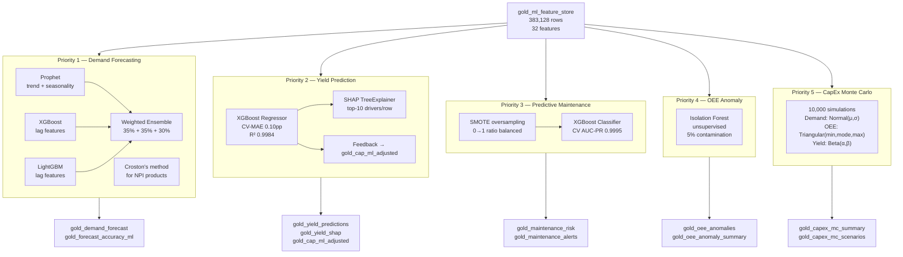
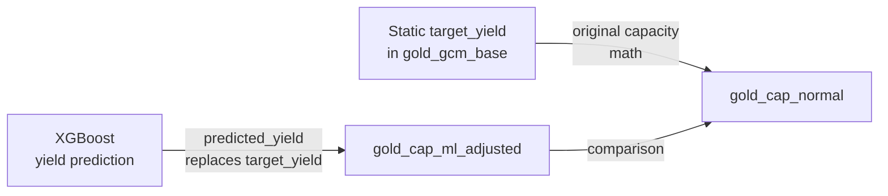

# Machine Learning — Model Documentation

> All 5 ML models are implemented in `src/ml/`. They read from `gold_ml_feature_store` and write output tables back to DuckDB.

---

## ML Architecture Overview

---

## Feature Store: `gold_ml_feature_store`

The feature store is the single input source for all 5 ML models.

| Column | Type | Description |
|---|---|---|
| `feat_pk` | VARCHAR | Primary key |
| `site_code` | VARCHAR | Manufacturing site |
| `product_number` | VARCHAR | Product identifier |
| `product_family` | VARCHAR | Product family grouping |
| `platform` | VARCHAR | Platform |
| `product_status` | VARCHAR | Active/NPI/EOL |
| `test_type` | VARCHAR | OTA/TRX/PIM etc. |
| `month_key` | INTEGER | yyyymm format |
| `snapshot_id` | VARCHAR | Planning snapshot |
| `demand_qty` | DOUBLE | Units demanded |
| `target_yield` | DOUBLE | First-pass yield target |
| `target_test_time_sec` | DOUBLE | Test time in seconds |
| `equip_qty_available` | INTEGER | Number of testers |
| `utilization_rate` | DOUBLE | Tester utilisation rate |
| `region` | VARCHAR | Geographic region |
| `supplier_name` | VARCHAR | Supplier |
| `month_of_year` | INTEGER | 1–12 |
| `quarter` | INTEGER | 1–4 |
| `year` | INTEGER | Calendar year |
| `is_quarter_end` | INTEGER | 1 if month = 3,6,9,12 |
| `is_actual` | INTEGER | 1 = actual, 0 = forecast |
| `demand_lag_1..12` | DOUBLE | Demand lagged 1,3,6,12 months |
| `demand_roll_avg_3..6` | DOUBLE | Rolling mean demand |
| `demand_roll_std_3` | DOUBLE | Rolling std demand |
| `yield_lag_1..3` | DOUBLE | Yield lagged 1,3 months |
| `yield_roll_avg_3` | DOUBLE | Rolling mean yield |
| `test_time_lag_1` | DOUBLE | Test time lag 1 month |
| `test_time_roll_avg_3` | DOUBLE | Rolling mean test time |

**Note**: `oee_pct` is joined in from `gold_oee_metrics` at load time in `ml_utils.load_feature_store()` — it is not stored in the feature store itself to avoid redundancy.

---

## Priority 1 — Demand Forecasting

**File**: `src/ml/models/demand_forecast.py`
**Output tables**: `gold_demand_forecast`, `gold_forecast_accuracy_ml`

### Problem

Predict demand for each product × site combination 18 months into the future, to support capacity planning and CapEx decisions.

### Algorithm: Weighted Ensemble

Three models are trained and combined with fixed weights:

| Model | Weight | Role |
|---|---|---|
| Prophet | 35% | Captures trend, yearly seasonality, structural breaks |
| XGBoost | 35% | Exploits lag features, cross-product patterns |
| LightGBM | 30% | Fast training on large lag feature matrix |

$$\hat{y} = 0.35 \cdot \hat{y}_{Prophet} + 0.35 \cdot \hat{y}_{XGB} + 0.30 \cdot \hat{y}_{LGB}$$

### NPI Products: Croston's Method

Products with fewer than 12 months of history use **Croston's intermittent demand method** instead of the ensemble.

Croston models demand and inter-arrival interval separately using exponential smoothing:

$$\hat{a}_{t} = \alpha \cdot z_t + (1-\alpha) \cdot \hat{a}_{t-1}$$

$$\hat{q}_{t} = \alpha \cdot p_t + (1-\alpha) \cdot \hat{q}_{t-1}$$

$$\hat{y} = \frac{\hat{a}}{\hat{q}}$$

Where $z_t$ = demand in period $t$ (non-zero only), $p_t$ = inter-arrival interval, $\alpha = 0.1$.

**Why Croston for NPI?** NPI demand is intermittent in early months — not zero, but highly irregular. Standard time-series models assume regularity; Croston separates the "how much" from "how often" questions.

### Training Process

1. Identify NPI combos (history < 12 months)
2. Build lag + rolling features for all series
3. Label-encode categorical columns
4. Train/test split: last 6 months held out for backtest
5. Fit XGBoost + LightGBM on training split; fit Prophet per-series on training split
6. Compute backtest metrics (MAPE, SMAPE, RMSE, MAE)
7. Retrain all models on full data
8. Generate 18-month forecasts for all combos

### Results

- **5,688 forecast rows** (316 product × site combos × 18 months)
- **Median MAPE: 8.3%** (good; industry benchmark 10–15%)
- **316 backtest accuracy rows**

---

## Priority 2 — Yield Prediction

**File**: `src/ml/models/yield_prediction.py`
**Output tables**: `gold_yield_predictions`, `gold_yield_shap`, `gold_cap_ml_adjusted`

### Problem

Predict first-pass yield for each product × site × test_type × month. Use predictions to replace static target yield in the capacity math engine, producing a dynamic capacity view.

### Algorithm: XGBoost Regressor + SHAP

**Why XGBoost?** Handles mixed numeric/categorical features naturally; supports SHAP TreeExplainer for exact Shapley value computation; robust to missing data.

**Why SHAP?** Shapley values are the only attribution method with mathematical guarantees (efficiency, symmetry, dummy, additivity properties). They answer: "by how much did feature X change this prediction from the average prediction?"

$$\phi_i = \sum_{S \subseteq F \setminus \{i\}} \frac{|S|!(|F|-|S|-1)!}{|F|!} [f(S \cup \{i\}) - f(S)]$$

In practice, TreeExplainer computes this in $O(TLD^2)$ time (T=trees, L=leaves, D=depth) rather than the $O(2^{|F|})$ brute-force complexity.

### Yield Feedback Loop

This is the architecturally significant feature of Priority 2:

The capacity math engine (Steps 1–5) is re-executed with `predicted_yield` substituted for `target_yield`. The result — `gold_cap_ml_adjusted` — shows how capacity changes when ML-predicted yield is used instead of historical averages.

### Training Process

1. Filter feature store to rows where `target_yield` is non-null and > 0
2. Build lag + rolling features for yield, OEE, demand
3. 5-fold TimeSeriesSplit cross-validation
4. Final model trained on full data
5. SHAP TreeExplainer run on all 383,128 rows
6. Top-10 SHAP features per row stored in `gold_yield_shap`
7. Capacity recalculated with predicted yield → `gold_cap_ml_adjusted`

### Results

- **CV-MAE: 0.10 percentage points** (e.g. predicts 85.1% when actual is 85.0%)
- **Train R²: 0.9984** (very high; expected for structured synthetic data)
- **383,128 yield predictions**
- **3,831,280 SHAP rows** (383K rows × 10 top features)
- **8,939,977 adjusted capacity rows**

---

## Priority 3 — Predictive Maintenance

**File**: `src/ml/models/predictive_maintenance.py`
**Output tables**: `gold_maintenance_risk`, `gold_maintenance_alerts`

### Problem

Predict whether a site × test_type combination will experience an OEE failure (OEE < 0.88) within the next 3 months, so maintenance can be planned proactively.

### Why 0.88 as the threshold?

OEE in this dataset ranges 0.8077–0.9767. A threshold of 0.88 captures the bottom ~13% of OEE values — meaningful degradation without flagging normal variation. Using 0.65 (the general-purpose threshold) would produce zero positive labels since no values fall below 0.81.

### Algorithm: XGBoost Classifier + SMOTE

**Class imbalance challenge**: With 13% positive rate, a naive classifier predicts all-negative and achieves 87% accuracy — useless. Two techniques address this:

1. **SMOTE** (Synthetic Minority Oversampling Technique): generates synthetic positive examples by interpolating between existing positives in feature space. Balances classes from 87:13 to 50:50 before training.

2. **scale_pos_weight=5**: Additional weight on positive class in the XGBoost loss function, compensating for remaining imbalance after SMOTE.

**Why AUC-PR instead of AUC-ROC?** For imbalanced datasets, ROC-AUC is overly optimistic (a model that predicts all-negative has AUC-ROC ≈ 0.5, but precision-recall AUC reflects the much harder precision problem at high recall). AUC-PR directly measures the quality of positive class predictions.

### Risk Tiers

| Tier | Probability | Action |
|---|---|---|
| LOW | 0–20% | Normal monitoring |
| MEDIUM | 20–40% | Increased monitoring frequency |
| HIGH | 40–70% | Schedule preventive maintenance |
| CRITICAL | 70–100% | Immediate intervention required |

### Results

- **Positive rate: 13.0%** (after threshold tuning)
- **CV AUC-PR: 0.9995**
- **Train ROC-AUC: 0.9983**
- **265,034 risk rows**
- **39,117 HIGH/CRITICAL alerts**

---

## Priority 4 — OEE Anomaly Detection

**File**: `src/ml/models/oee_anomaly.py`
**Output tables**: `gold_oee_anomalies`, `gold_oee_anomaly_summary`

### Problem

Detect unusual OEE patterns without labelled data. Unlike Priority 3 (which requires a defined failure threshold), anomaly detection flags statistically unusual behaviour regardless of whether it crosses a predefined threshold.

### Algorithm: Isolation Forest

Isolation Forest is an unsupervised anomaly detection algorithm. It isolates observations by randomly selecting a feature and splitting at a random value between the feature's min and max. Anomalous points require fewer splits to isolate (they're already isolated from the bulk of the data).

**Anomaly score**: Average path length across all trees. Shorter path = more anomalous. Normalised to [-1, +1] where negative scores indicate anomalies.

**Contamination = 0.05**: 5% of points are expected to be anomalous. This controls the decision boundary.

**Why unsupervised?** OEE anomalies can take many forms — sudden drops, unusual volatility, gradual drift — and are hard to label exhaustively. Isolation Forest detects all forms without requiring labelled examples.

### Features Used

- OEE lags (1, 2, 3 months)
- OEE rolling mean and std (3, 6 months)
- Demand lags and rolling stats
- Yield lags and rolling stats
- OEE volatility (std over 3-month window)
- OEE deviation from site average

### Results

- **265,034 rows scored**
- **13,252 anomalies flagged (exactly 5.0%)** — matches contamination parameter
- **22 site-level summary rows**

---

## Priority 5 — Monte Carlo CapEx Optimisation

**File**: `src/ml/models/capex_montecarlo.py`
**Output tables**: `gold_capex_mc_summary`, `gold_capex_mc_scenarios`

### Problem

Given uncertainty in future demand, yield, and OEE, how many testers should a site purchase to meet demand with a specified service level (probability of not being caught short)?

### Algorithm: Monte Carlo Simulation

10,000 iterations per site × test_type combination. Each iteration:

1. **Sample demand**: $\text{Demand} \sim \mathcal{N}(\mu, \mu \cdot CV)$ where CV is the coefficient of variation from historical data
2. **Sample OEE**: $\text{OEE} \sim \text{Triangular}(\min, \text{mode}, \max)$ from site OEE history
3. **Run capacity math**: Compute supply per tester using Steps 2–5 with sampled OEE
4. **Compute equipment needed**: $\lceil \text{Demand} / \text{Supply per tester} \rceil$

### Output Percentiles

| Percentile | Meaning | Use Case |
|---|---|---|
| **P50** | 50% of scenarios need ≤ this many testers | Optimistic planning; lower cost, higher risk |
| **P80** | 80% of scenarios are satisfied | **Recommended planning target** — balances cost and stockout risk |
| **P95** | 95% of scenarios are satisfied | Conservative; near-zero risk, higher cost |

### Uncertainty Distributions

| Variable | Distribution | Rationale |
|---|---|---|
| Demand | Normal(μ, μ×CV) | Demand variation around forecast is approximately symmetric |
| OEE | Triangular(min, mode, max) | Bounded by observed history; mode is most likely value |
| Yield | Beta(α, β) | Yield is bounded [0,1]; Beta is the natural distribution for fractions |

Beta parameters α, β are fit using method of moments from historical yield data:

$$\alpha = \mu \left(\frac{\mu(1-\mu)}{\sigma^2} - 1\right), \quad \beta = (1-\mu) \left(\frac{\mu(1-\mu)}{\sigma^2} - 1\right)$$

### Equipment Costs

| Test Type | Unit Cost (USD) |
|---|---|
| OTA | $850,000 |
| TRX | $620,000 |
| PIM | $480,000 |
| PAM | $720,000 |
| FCT | $95,000 |
| ICT | $110,000 |
| BIT | $85,000 |
| ALT | $160,000 |
| UC | $200,000 |
| AT | $130,000 |

### Results

- **181 site × test_type combos simulated**
- **10,000 iterations per combo**
- **27 combos need investment at P80**
- **Total P80 CapEx recommendation: $32,070,000**
- **543 scenario rows** (3 scenarios × 181 combos)
