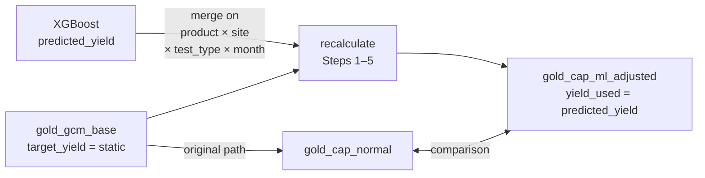

# Yield Prediction

> **File**: `src/ml/models/yield_prediction.py`
> **Output tables**: `gold_yield_predictions` (383,128 rows), `gold_yield_shap` (3,831,280 rows), `gold_cap_ml_adjusted` (8,939,977 rows)
> **Run time**: ~8 min (SHAP on 383K rows dominates)

---

## What problem does this solve?

> *"What will first-pass yield actually be — and how does that change effective capacity?"*

Static `target_yield` in the GCM config is a planning assumption, not a prediction. Real yield drifts with equipment age, operator performance, product complexity, and NPI ramp. This model predicts yield per product × site × test_type × month and feeds those predictions back into the capacity math engine.

---

## Why XGBoost for regression?

| Criterion | XGBoost | Why it wins here |
|---|---|---|
| Mixed feature types | ✅ Native | Yield depends on categorical (site, test_type) + numeric (lag, OEE) |
| SHAP compatibility | ✅ TreeExplainer | Exact Shapley values, not approximations |
| Missing data | ✅ Handles natively | Yield lags have nulls for early months |
| Interpretability | ✅ Via SHAP | Explainability is a core requirement |

---

## What features drive yield prediction?

| Feature group | Columns |
|---|---|
| Yield history | `avg_yield_lag1`, `_lag2`, `_lag3`, `_lag6`, `yield_roll3_mean`, `_roll6_mean` |
| OEE signals | `avg_oee`, `avg_oee_lag1`, `avg_oee_lag3`, `avg_oee_roll3_mean` |
| Demand load | `demand`, `demand_lag1`, `demand_roll3_mean` |
| Time features | `month_of_year`, `year`, `quarter` |
| Encoded categoricals | `site_id`, `product_id`, `platform_id`, `family_id`, `test_type_id` |

**Target**: `avg_yield` (normalised from `target_yield`, range 0–1, clipped to [0.01, 1.0] on prediction)

---

## How does SHAP explain individual predictions?

SHAP (SHapley Additive exPlanations) assigns each feature a contribution value for each prediction:

$$\phi_i = \sum_{S \subseteq F \setminus \{i\}} \frac{|S|!(|F|-|S|-1)!}{|F|!} [f(S \cup \{i\}) - f(S)]$$

- **Positive** $\phi_i$ → feature pushed yield **above** average
- **Negative** $\phi_i$ → feature pushed yield **below** average
- Sum of all $\phi_i$ = prediction − base value (exact decomposition)

`TreeExplainer` computes this exactly for tree models in $O(TLD^2)$ time rather than $O(2^{|F|})$ brute force.

**Top-10 features by |SHAP| are stored per row** → `gold_yield_shap` (3,831,280 rows = 383,128 × 10).

---

## What is the yield feedback loop?

This is the architecturally significant feature of Priority 2. After predicting yield, the 5-step capacity math is re-executed with `predicted_yield` replacing `target_yield`:



Steps recomputed in `recalculate_capacity_with_ml_yield()`:

```python
# Step 1 (Type 1 retest, retest_times=2.0, test_x_param=0.75)
step1 = (handling_time_sec + target_test_time_sec) \
        * (1 + (1 - yield_used) * 2.0 * 0.75)

step2 = step1 / utilization_rate

step3 = (hours_per_shift_normal * 3600
         * (1 - allowance_pct) * productivity_pct) / step2

step4 = working_days_normal * shifts_per_day_normal

supply_ml            = equip_qty_available * step3 * step4
utilization_ratio_ml = demand / supply_ml
capacity_gap_pct_ml  = (supply_ml - demand) / demand * 100
```

**Why this matters**: If ML predicts yield will drop from 0.87 to 0.80 for a product, Step 1 increases (more retests), Step 3 decreases (fewer units per shift), supply drops — revealing a capacity shortfall that static planning would miss.

---

## Critical implementation detail — type safety on merge

`encode_categoricals()` converts `product_id`, `site_id`, `test_type_id` to int8 category codes before training. The encoded `fs_feat` DataFrame **cannot** be used for the DuckDB merge — `gold_gcm_base` stores these as VARCHAR.

**Fix**: predictions are merged back onto `fs` (original, un-encoded):

```python
fs["predicted_yield"] = fs_feat["predicted_yield"].values  # same row order
yield_pred_df = fs[["product_id", "site_id", "test_type_id",
                     "month", TARGET, "predicted_yield"]].copy()
```

Then renamed to raw column names (`product_number`, `site_code`, `test_type`, `month_key`) before merging with `gold_gcm_base`.

---

## Training process

| Step | Detail |
|---|---|
| Filter | Rows where `avg_yield` is non-null and > 0 → 383,128 rows |
| Features | Build lag + rolling features; encode categoricals |
| CV | 5-fold `TimeSeriesSplit`; compute MAE per fold |
| Final model | Retrain on full data |
| SHAP | `TreeExplainer` on all 383,128 rows; keep top-10 per row |
| Feedback | Re-run Steps 1–5 with `predicted_yield` → `gold_cap_ml_adjusted` |

---

## XGBoost hyperparameters

| Parameter | Value |
|---|---|
| `n_estimators` | 400 |
| `learning_rate` | 0.04 |
| `max_depth` | 7 |
| `subsample` | 0.8 |
| `colsample_bytree` | 0.7 |
| `min_child_weight` | 5 |
| `reg_alpha` | 0.05 |
| `reg_lambda` | 1.5 |

Deeper trees (depth 7) vs demand forecasting (depth 6) — yield has more complex interaction terms (OEE × product × site).

---

## Results

| Metric | Value | Interpretation |
|---|---|---|
| CV-MAE | **0.10 pp** | Predicts 85.1% when actual is 85.0% |
| Train R² | **0.9984** | Near-perfect fit on synthetic data |
| Yield prediction rows | 383,128 | Full feature store coverage |
| SHAP rows | 3,831,280 | 10 drivers per prediction |
| ML-adjusted capacity rows | 8,939,977 | All GCM combos recalculated |

High R² is expected — synthetic yield is generated from deterministic rules that the model can learn precisely.

---

## Output table schemas

### `gold_yield_predictions`

| Column | Type | Description |
|---|---|---|
| `product_id`, `site_id`, `test_type_id` | VARCHAR | Series identifier |
| `month` | INTEGER | yyyymm |
| `avg_yield` | DOUBLE | Actual yield |
| `predicted_yield` | DOUBLE | ML prediction |
| `yield_residual` | DOUBLE | predicted − actual |
| `abs_error_pp` | DOUBLE | \|residual\| × 100 |

### `gold_yield_shap`

| Column | Type | Description |
|---|---|---|
| `row_idx` | INTEGER | Row index in `gold_yield_predictions` |
| `feature` | VARCHAR | Feature name |
| `shap_value` | DOUBLE | Signed contribution |
| `abs_shap` | DOUBLE | Absolute importance |

### `gold_cap_ml_adjusted`

| Column | Type | Description |
|---|---|---|
| `product_number`, `site_code`, `test_type`, `month_key` | VARCHAR/INT | Keys |
| `target_yield` | DOUBLE | Static baseline |
| `yield_used` | DOUBLE | ML-predicted yield |
| `step1..step4` | DOUBLE | Recomputed steps |
| `supply_ml` | DOUBLE | Supply with ML yield |
| `utilization_ratio_ml` | DOUBLE | Demand / supply_ml |
| `capacity_gap_pct_ml` | DOUBLE | Gap % with ML yield |
| `effective_demand_qty`, `equip_qty_available` | DOUBLE/INT | From GCM base |
